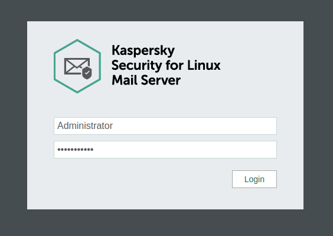

# Антиспам

Раздел **Антиспам** состоит из трёх подразделов: **Основное** и **Настройки фильтрации**.

## Основное

Позволяет управлять работой службы антиспама на основе технологий Лаборатории Касперского с функцией машинного обучения и искусственного интеллекта. Также на этой вкладке предоставлена возможность добавления лицензионного ключа антиспама. Ключ поставляется в файле, имеющем расширение `.key`. Если была приобретена лицензию на антиспам, но не нет в распоряжении лицензионного ключа, проверьте переписку с отделом продаж нашей компании (sales@ideco.ru) на наличие вложений. В случае, если вложения не найдены, запросите ключ заново, выслав письмо на sales@ideco.ru с указанием наименования организации или номером лицензии.


Перед загрузкой ключа обязательно включите модуль антиспама.


***

## Настройки фильтрации

* **Сортировка спама.** Задание логики сортировки нежелательной корреспонденции (спама). На выбор предоставляются следующие опции: отключение сортировки, перемещение нежелательных отправлений в папку Spam, удаление таких писем с сервера;
* **Почтовый ящик для спама.** Весь входящий спам будет пересылаться на указанный ящик (не используйте ящик Spam);
* **Ящики, исключенные из сортировки спама.** Позволяет задать почтовые ящики, при отправлении на которые корреспонденция не будет проверяться на спам.

***

## Веб-интерфейс для Антиспама


Для включения веб-интерфейса Антиспама, требуется, чтобы сам модуль **Антиспам** был включен.


Веб-интерфейс имеет следующие преимущества:

* Отображать статистику по категориям Антиспама Касперского в удобном и понятном виде;
* Генерировать отчеты по работе за определенный период;
* Отображает очередь обрабатываемых сообщений;
* Позволяет задавать правила *Запрещенных и Разрешенных адресов*;
* Ведение аудита всех действий, производимых с Антиспамом.

Чтобы включить Веб-интерфейс для Антиспама:

1\. Перейдите в раздел **Управление сервером -> Терминал** и выполните следующую команду `/opt/kaspersky/klms/bin/klms-control --set-web-admin-password`

2\. Задайте пароль для стандартного аккаунта **Administrator**, состоящий из:

* Строчных букв;
* Заглавных букв;
* Специальных символов;
* Чисел;
* Содержать минимум 8 символов.

3\. Для доступа к Веб-интерфейсу перейдите в адресной строке по пути `utm_ip_address:8443/klms/`

4\. Войдите в веб-интерфейс с учетной записью **Administrator** и ранее заданным в терминале паролем.

После успешного входа, будет отображен дашборд со статистикой работы Антиспама.


Настоятельно не рекомендуем Вам вносить какие-либо изменения в разделе `Settings`, потому как не можем гарантировать функциональность работы Антиспама в таких случаях.

