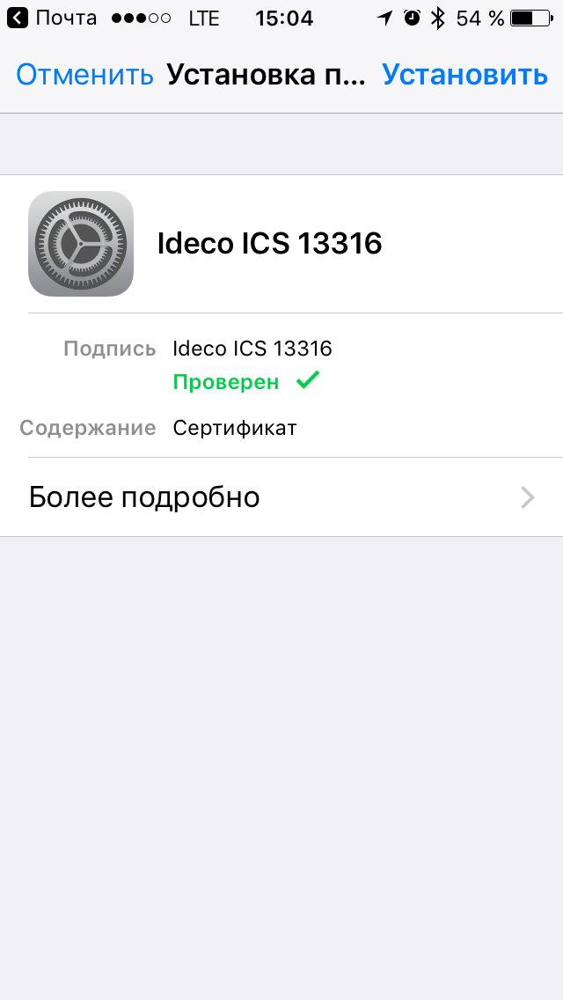
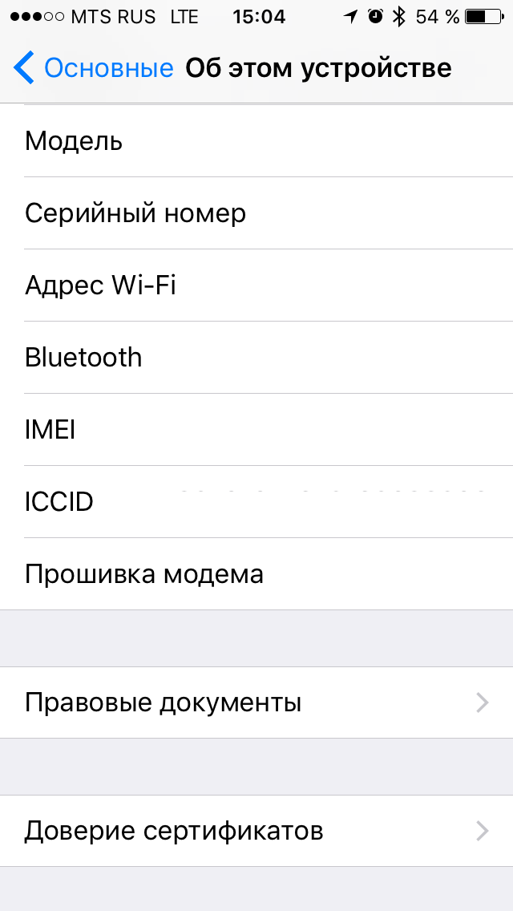
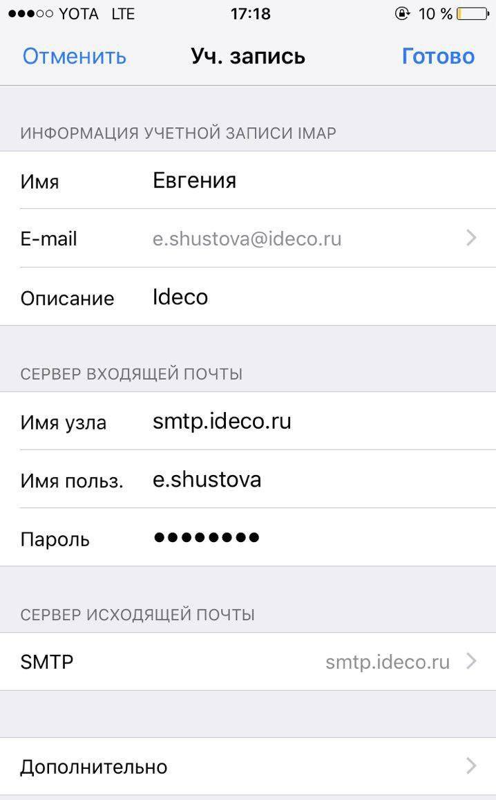
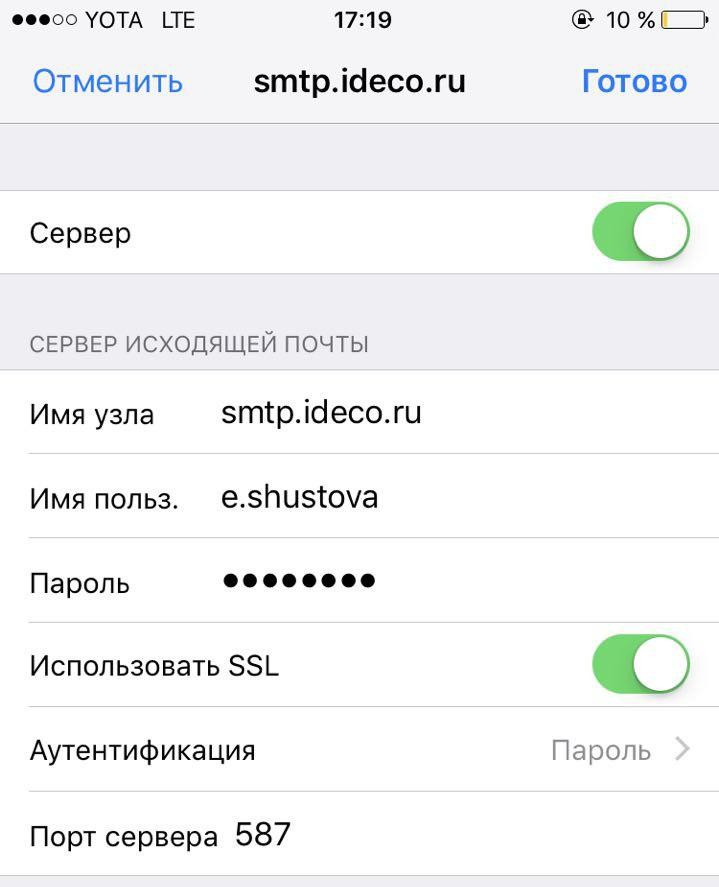
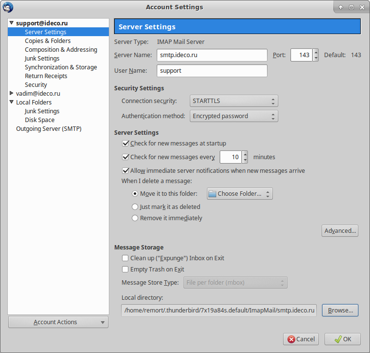

# Настройка почтовых клиентов


Начиная с версии UTM 7.0.0, подключиться из сети Интернет программой Outlook \(любой версии\) по протоколу POP3 нельзя. Outlook не поддерживает тип шифрования STARTTLS для POP3, а поддерживает только устаревшие и небезопасные SSL/TLS, которые в нашем почтовом сервере более не используются. Подключение без шифрования извне также запрещено на нашем почтовом сервере. Тем не менее остается возможность подключаться по протоколу IMAP с использованием STARTTLS. Для этого выберите тип шифрования **Авто** в Outlook.


## Настройка почтового клиента при работе из локальной сети

1. Сервер входящей почты работает на 995 TCP порту \(РОР3\) и на 143 TCP порту \(IMAP\) с шифрованием STARTTLS/SSL.

    1.1. В качестве логина прописывается логин от учётной записи пользователя.

    1.2. В качестве пароля всегда прописывается пароль от учётной записи пользователя \(в том числе для пользователей, импортированных из Active Directory\), задать отдельный пароль на почтовый ящик нельзя.

2. Сервер исходящей почты работает на 587 порту TCP с шифрованием STARTTLS. Без авторизации возможна отправка почты только из доверенных сетей \(их можно настроить в разделе **Почтовый релей -&gt; Расширенные настройки -&gt; Безопасность**\).

   **Настройка почтового клиента при работе из сети Интернет.**

3. Сервер входящей почты работает на 995 TCP порту \(POP3S\) и на 143 TCP порту \(IMAP-STARTTLS\), шифрование обязательно.

    1.1. В качестве логина прописывается логин от учётной записи пользователя.

    1.2. В качестве пароля всегда прописывается пароль от учётной записи пользователя, сделать отдельный пароль на почту нельзя.

4. Сервер исходящей почты работает только с авторизацией и шифрованием. Необходимо обязательно использовать 587 порт для подключения \(а не 25\). Тип шифрования, логин и пароль указываются аналогично серверу входящей почты.

Для любого почтового клиента, кроме веб-интерфейса почты в составе UTM, установите корневой сертификат сервера UTM, его можно скачать в разделе **Сервисы -&gt; Сертификаты**.

## Примеры настроек популярных почтовых клиентов

### Настройка почтового клиента Outlook 2013 и 2016

Пример настроек клиента Microsoft Outlook 2013 по протоколу IMAP:  

Пример настроек клиента Microsoft Outlook 2016 по протоколу IMAP:  

Для отображения IMAP-папок снимите галочку **При просмотре дерева в Outlook показывать только подписанные папки** в свойствах IMAP-папок:  

### Настройка почтового клиента iPhone

Перед настройкой ящика надо установить корневой SSL сертификат UTM. Его можно скачать в разделе **Сервисы -&gt; Сертификаты**. Например, прислав сертификат себе на почту, откройте его на iPhone. Нажмите кнопку **Установить**. После этого зайдите в раздел **Настройки -&gt; Основные -&gt; Об этом устройстве -&gt; Доверие сертификатов** и включите настройку **Доверять корневым сертификатам полностью**.

После установки сертификата настройте доступ в почтовый ящик как показано на следующих скриншотах:

### Настройка почтового клиента Thunderbird

