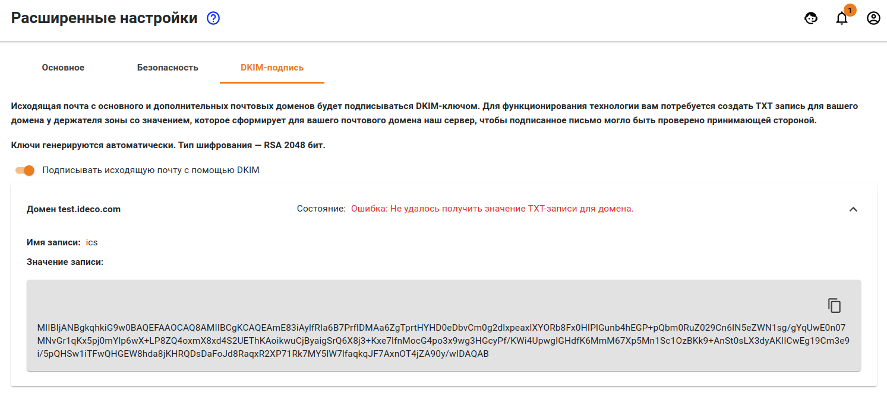

# Настройка домена у регистратора/держателя зоны

Для создания почтового сервера вам потребуется доменное имя. Вы можете зарегистрировать его у вашего интернет-провайдера или напрямую у регистратора, например, в [RUcenter](https://www.nic.ru/).

После того как вы зарегистрируете доменное имя, вам потребуется внести изменения в описание зоны на DNS-сервере \(у держателя доменной зоны, которой зачастую является регистратор\).

1. Создайте ресурсную запись типа А с именем для почтового сервера в вашем домене, указывающую на внешний IP-адрес Ideco UTM.  **Убедитесь, что на внешнем интерфейсе UTM назначен публичный адрес, доступный из сети Интернет.**
2. Добавьте ресурсную запись типа MX, указывающую на A-запись, которая была создана на предыдущем шаге. Запись типа MX указывает на сетевой узел, который занимается обработкой почтовых сообщений для домена. Она должна ссылаться на доменное имя почтового сервера, а не на IP-адрес.
3. Также обязательно добавьте обратную ресурсную запись типа PTR. Эта запись должна быть прописана в файле обратной зоны. Эти изменения должны быть сделаны на стороне вашего интернет-провайдера. Обратитесь к нему с просьбой прописать обратную ресурсную запись для вашего IP-адреса, которая должна ссылаться на вашу запись типа MX.
4. Рекомендуем настроить SPF-запись для вашего почтового сервера.
5. После настройки почтового сервера рекомендуем настроить также DKIM-подпись почтовых сообщений. Для этого перейдите в раздел **Почтовый релей -&gt; Расширенные настройки -&gt; DKIM-подпись** и активируйте пункт **Подписывать исходящую почту с помощью DKIM**.

Рассмотрим набор необходимых записей на примере вымышленного домена `example.net`:

* А-запись вида `mail.example.net. IN A 23.45.67.89`, где 23.45.67.89 - это внешний IP-адрес Ideco UTM.
* MX-запись вида `example.net. MX 10 mx.example.net`.
* SPF-запись объявляющая другим почтовым серверам в Интернет, что отправка писем с вашего домена разрешена только с хоста почтового сервера, указанного в MX-записи: `example.net. IN TXT "v=spf1 a mx -all"`. 

При использовании почтового сервера на UTM в качестве почтового релея ресурсные записи будут выглядеть так же, так как в Интернете ваш почтовый сервер в локальной сети будет представлен SMTP-релеем на UTM.

