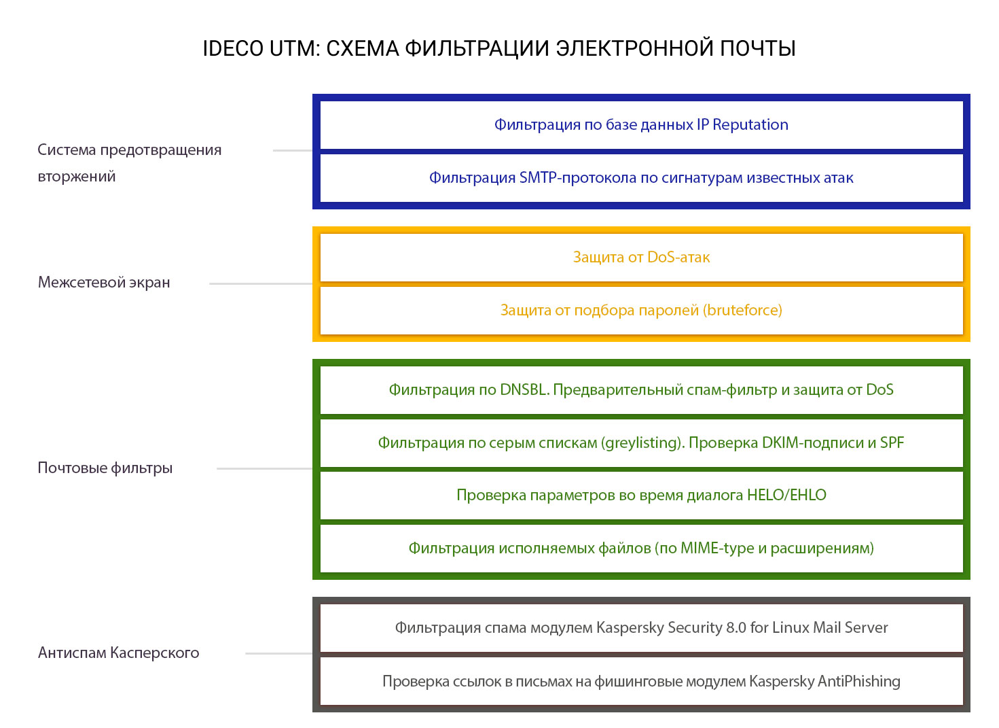

# Схема фильтрации почтового трафика

Полная схема и последовательность фильтрации представлена на схеме. 

Модуль Антиспама Касперского в свою очередь использует собственный набор методик для фильтрации спама. Он обеспечивает высокий уровень детектирования спама при низких значениях ложных срабатываний \(0,003-0,005% от общего количества сообщений\). Для защиты пользователей используется большой набор технологий распознавания спама с использованием внешних облачных сервисов \(DNSBL, SPF и SURBL\) и собственных алгоритмов: сигнатурный анализ текста и графики, лингвистический эвристик, использование UDS-запросов в режиме реального времени. Также проверяются все ссылки в почтовых сообщениях, письма со ссылками на фишинговые ресурсы блокируются.

Белый список в настройках почты обеспечивает прохождение писем без фильтрации начиная с уровня "Фильтрации по серым спискам и проверки DKIM/SPF". Предварительные спам-фильтры срабатывают для любых адресатов.

