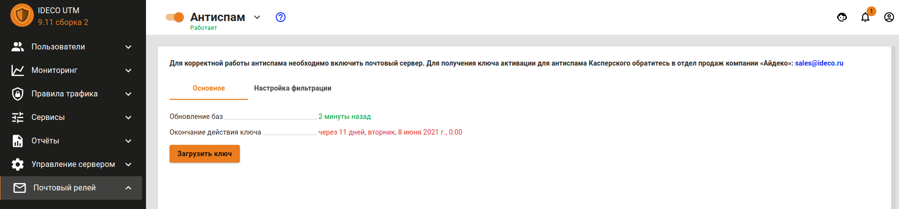
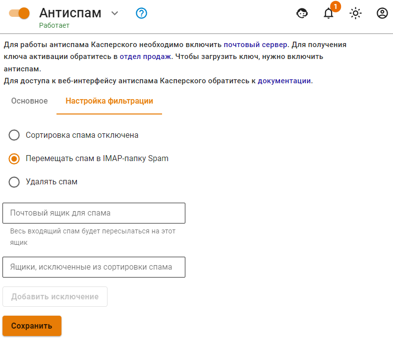
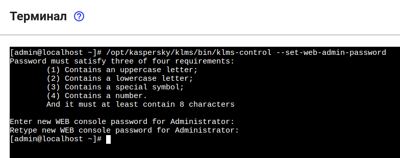
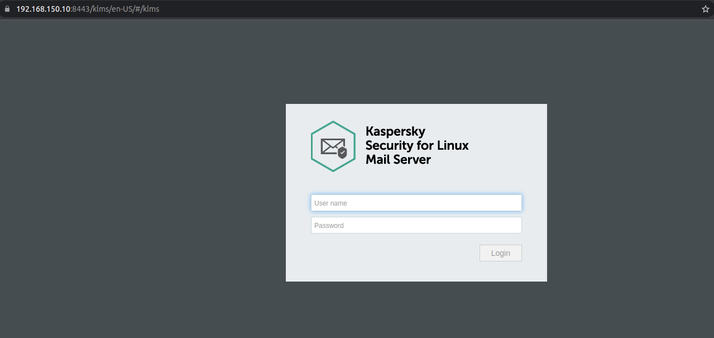
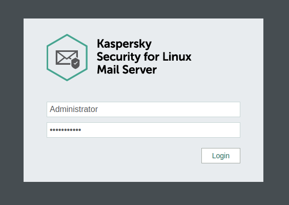
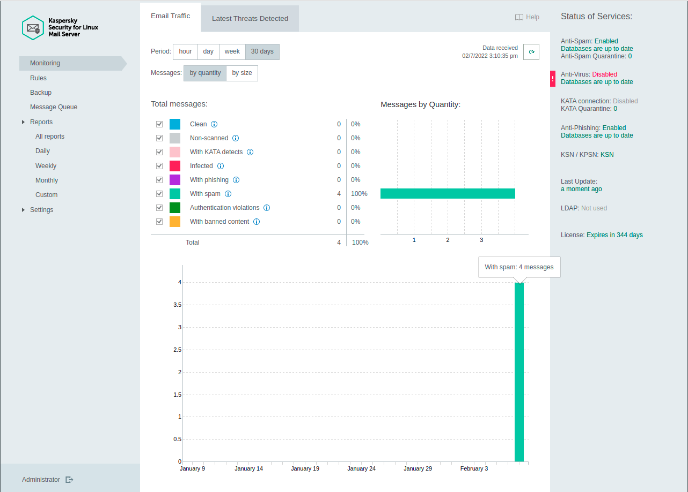
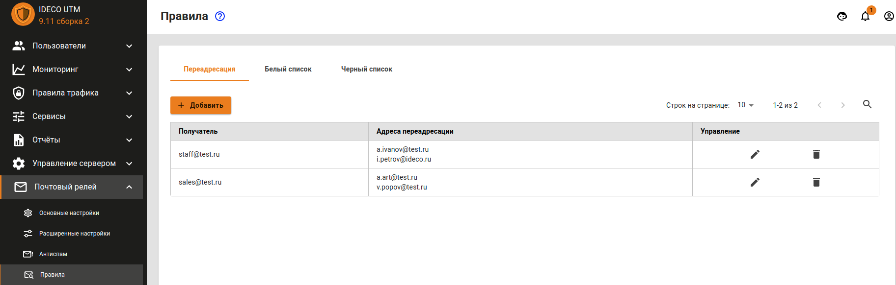
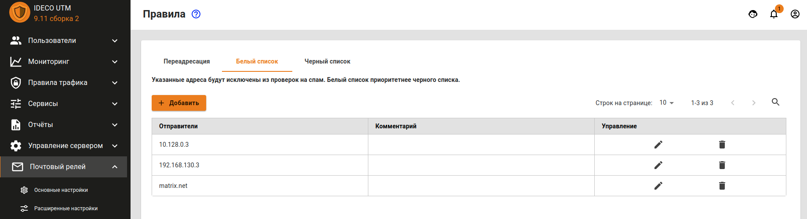
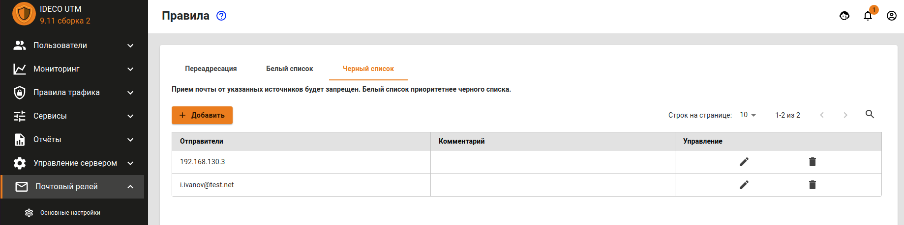

# Настройка почтового сервера

Проверка. [#veb-interfeis-dlya-antispama](mail-server-settings.md#veb-interfeis-dlya-antispama "mention")


Все возможности по фильтрации почтового трафика возможно также применить к внутреннему почтовому серверу, опубликовав его через почтовый релей.


Для настройки почтового сервера в веб-интерфейсе Ideco UTM необходимо перейти в меню **Почтовый релей**. В этом разделе находятся все ключевые параметры, влияющие на работу почтовой службы. Все настраиваемые параметры разделены по нескольким категориям. Ниже описан каждый раздел почтового сервера.


Если вы используете почтовый сервер Ideco UTM как полноценный сервер с хранением почты, обязательным является хранение почты на дополнительном HDD/SSD диске. Подключите дополнительный жесткий диск к серверу перед использованием почты.



При настройке [кластера ](../cluster.md)почта будет доступна для работы только в режиме почтового релея. Хранение почтовых ящиков отключено.


## Основные настройки

Раздел основных настроек включает в себя множество базовых параметров, необходимых для работы почтового сервера в сети Интернет.

* **Основной почтовый домен.** Указывает серверу на его почтовый домен, для которого он должен принимать и обрабатывать письма. Все ящики пользователей будут принадлежать этому домену. От имени этого домена вы будете вести переписку с корреспондентами.
* **Имя хоста почтового сервера.** Как правило, совпадает с MX-записью для вашего домена. Это имя должно разрешаться из сети Интернет во внешний IP-адрес UTM. Используется почтовым сервером в диалоге при транспорте почты между другими почтовыми серверами как уникальный идентификатор. Необходимо для корректной работы почтового сервера в сети Интернет.
* **Дополнительные почтовые домены.** Дополнительные домены, которые почтовый сервер будет считать своими. Корреспонденция, отправляемая с ящиков в этих почтовых доменах также будет обрабатываться сервером при условии правильной установки MX-записей.
* **Relay-домены.** Почтовые домены в локальной сети, для которых будут пересылаться письма извне.
*   **Диск для хранения почты.** Если вы используете почтовый сервер Ideco UTM как полноценный сервер с хранением почты, то начиная с версии 7.9.0 обязательным является хранение почты на дополнительном HDD/SSD диске. Поддерживаются только SATA/SAS накопители. Перед подключением диска - заполните поля **Основной почтовый домен** и **Имя хоста почтового сервера**, а так же включите почту.

    **Если вы подключили диск, но он не отображается, то, пожалуйста, обратитесь в техническую поддержку: по телефону +7 (495) 662-87-34 или по почте support@ideco.ru.**
* **IMAP(S) (143 STARTTLS, 993 SSL).** Задействование возможности работы с почтовыми ящиками сервера по протоколу IMAP (с шифрованием STARTTLS) из локальной сети и Интернет.
* **POP3(S) (110 STARTTLS, 995 SSL).** Задействование возможности работы с почтовыми ящиками сервера по протоколу POP3 (с шифрованием STARTTLS) из локальной сети и Интернет.
* **Web-почтa.** Включение веб-интерфейса почтового клиента для доступа к почте на сервере из локальной сети.

### SSL-сертификат для почтового домена

После сохранения настроек основного почтового домена и имени хоста почтового сервера Ideco UTM создает локальный сертификат, подписанный корневым (самоподписанным) сертификатом. Параллельно с созданием локального сертификата, отправляется запрос на выпуск сертификата Let’s Encrypt.

* Если сертификат Let’s Encrypt успешно выписался, то он заместит собой локальный сертификат.
* Если выпуск сертификата Let’s Encrypt завершился неудачей, то будет использоваться локальный сертификат.


Работа с сертификатами ведётся в разделе **Сервисы -> Сертификаты**.



Если вы хотите заменить автоматически выпущенный сертификат на свой, то при загрузке собственной цепочки сертификатов **CN(Общее имя)** крайнего сертификата должно соответствовать домену, для которого сертификат загружается.



Для загрузки своего сертификата на сервер вы можете воспользоваться [инструкцией](../services/certificates/upload-ssl-certificate-to-server.md).


## Расширенные настройки

Раздел **Расширенные настройки** состоит из двух подразделов: **Основное, Безопасность, DKIM-подпись**.

### Основное

* **Внешний SMTP-релей.** Вся исходящая почта будет отправляться на указанный адрес. Используется, например, если почта должна проходить через вышестоящий сервер провайдера перед отправкой в сеть Интернет.
* **Пересылать всю исходящую почту на адрес.** Вся исходящая почта будет дублироваться на указанный почтовый ящик. Рекомендуется включать только при крайней необходимости.
* **Пересылать всю входящую почту на адрес.** Вся входящая почта будет дублироваться на указанный почтовый ящик. Рекомендуется включать только при крайней необходимости.
* **Максимальный размер ящика.** Ограничение на максимальный размер почтового ящика в мегабайтах.
* **Максимальный размер письма.** Ограничение на максимальный размер формируемого сервером письма в мегабайтах.
* **Срок хранения сообщений в корзине.** Количество дней в течении которых почта хранится в корзине перед удалением.

### Безопасность

* **Поддержка SASL для аутентификации SMTP-клиентов.** Подключившись к почтовому ящику из интернета и отправить письмо, используя SMTP сервер Ideco, можно будет только пройдя авторизацию по логину и паролю, заданному для этой учетной записи пользователя на сервере. **Не включайте данный параметр, если используете UTM в качестве почтового релея.**
* **Разрешить аутентификацию только через защищенное соединение (TLS).** Запрещает незащищенную передачу учетных данных клиента при аутентификации на SMTP сервере.
* **Фильтрация по серым спискам (greylisting) для входящей почты.** Включает фильтрацию по серым спискам (greylisting) для входящей почты. При этом почта от неизвестных доменов отправителей может приходить с небольшой задержкой.
* **Фильтрация по DNSBL для входящей почты.** Включает фильтрацию по DNSBL для входящей почты.
* **Доверенные сети.** Авторизация на сервере для доступа к почтовому ящику не требуется при попытке доступа из этих сетей. Указываются IP-сети и хосты в нотации CIDR или с префиксом сети, например, `10.0.0.5/255.255.255.255` или `192.168.0.0/16`.

### DKIM-подпись

Настраивается в разделе **Почтовый релей -> Расширенные настройки -> DKIM-подпись.** Подписывает исходящую с сервера корреспонденцию уникальной для вашего почтового домена подписью так, что другие почтовые серверы в сети Интернет могут убедиться, что ваша почта легитимна и заслуживает доверия.

Для функционирования технологии вам потребуется создать TXT запись для вашего домена у держателя зоны со значением, которое сформирует для вашего почтового домена наш сервер. Для формирования записи, проверьте, настроено ли:

1\. В разделе **Почтовый релей -> Основные настройки** сохранен **Основной почтовый домен, Имя хоста почтового сервиса** и при необходимости **Дополнительные почтовые домены**.

2\. Поставлен переключатель **Основные настройки** в положение включен.

3\. В разделе **Почтовый релей -&gt; Расширенные настройки -&gt; DKIM-подпись** и активирован пункт **Подписывать исходящую почту с помощью DKIM**. Подробнее о настройке вашего домена у держателя зоны в статье [Настройка домена у регистратора/держателя зоны](domain-settings-at-zone-holder.md).

TXT записи будут сформированы для основного почтового домена, настроенного на Ideco UTM, и дополнительных почтовых доменов (если указаны). Сервер также проверит, правильно ли была указана запись для вашей зоны, и резолвится ли она в сеть Интернет. 


Объем TXT-записи достаточно велик и многие регистраторы/держатели зон испытывают сложности с предоставлением интерфейса клиентам для указания TXT-записей длиннее 256 символов. Зачастую они предоставляют возможность указания TXT-записей длиной до 256 символов, согласно стандарту RFC1035. Но другой стандарт, RFC4408, предполагает объединение строк в случаях, когда нужно использовать длинные TXT-записи при настройки SPF и DKIM. Оперируйте этой информацией в диалоге с держателем вашей доменной зоны. Как правило, держатели зон находят способ создания длинных TXT записей.


## Антиспам

Раздел **Антиспам** состоит из трёх подразделов: **Основное** и **Настройки фильтрации**.

### Основное

Позволяет управлять работой службы антиспама на основе технологий Лаборатории Касперского с функцией машинного обучения и искусственного интеллекта. Также на этой вкладке предоставлена возможность добавления лицензионного ключа антиспама. Ключ поставляется в файле, имеющем расширение `.key`. Если вы приобретали лицензию на антиспам, но не имеете в своём распоряжении лицензионного ключа, проверьте переписку с отделом продаж нашей компании (sales@ideco.ru) на наличие вложений. В случае, если вы не нашли таких вложений, запросите ключ заново, выслав письмо на sales@ideco.ru с указанием наименования вашей организации или номером вашей лицензии.


Перед загрузкой ключа обязательно включите модуль антиспама.


### Настройки фильтрации

* **Сортировка спама.** Задание логики сортировки нежелательной корреспонденции (спама). На выбор предоставляются следующие опции: отключение сортировки, перемещение нежелательных отправлений в папку Spam, удаление таких писем с сервера.
* **Почтовый ящик для спама.** Весь входящий спам будет пересылаться на указанный ящик (не используйте ящик Spam).
* **Ящики, исключенные из сортировки спама.** Позволяет задать почтовые ящики, при отправлении на которые корреспонденция не будет проверяться на спам.

### Веб-интерфейс для Антиспама


Для вкючения веб-интерфейса Антиспама, требуется, чтобы сам модуль **Антиспам** был включен.


Веб-интерфейс имеет следующие преимущества:

* Отображать статистику по категориям Антиспама Касперского в удобном и понятном виде;
* Генерировать отчеты по работе за определенный период;
* Отображает очередь обрабатываемых сообщений;
* Позволяет задавать правила "Черных и белых листов";
* Ведение аудита всех действий, производимых с Антиспамом.

Чтобы включить Веб-интерфейс для Антиспама:

1\. Перейдите в раздел **Управление сервером -> Терминал** и выполните следующую команду `/opt/kaspersky/klms/bin/klms-control --set-web-admin-password`

2\. Задайте пароль для стандартного аккаунта **Administrator**, состоящий из:

1\) Строчные буквы;\
2\) Заглавные буквы;\
3\) Специальные символы;\
4\) Числа;\
5\) Содержать минимум 8 символов.

3\. Для доступа к Веб-интерфейсу перейдите в адресной строке по пути `utm_ip_address:8443/klms/`

4\. Войдите в веб-интерфейс с учетной записью **Administrator** и ранее заданным в терминале паролем.

После успешного входа, будет отображен дашборд со статистикой работы Антиспама.


Настоятельно не рекомендуем Вам вносить какие-либо изменения в разделе `Settings`, потому как не можем гарантировать функциональность работы Антиспама в таких случаях.


## Правила

Раздел **Правила** состоит из трёх подразделов: **Переадресация, Белый список, Черный список**.

### Переадресация

Позволяет настроить переадресацию почты на сервере с помощью почтовых алиасов. Алиасы, в отличие от почтовых ящиков, не требуют логинов и паролей, они закрепляются за ящиком и служат его копией с другим именем, или, в случае назначения алиаса нескольким почтовым ящикам, может служить группой рассылки. Поступающая на алиас почта автоматически пересылается на все реальные почтовые ящики, связанные с этим алиасом. Если перенаправление делается на какой-либо ящик в другом домене в сети Интернет, то ящик, прописываемый в графе **Получатель**, должен реально существовать.

Подробнее с документацией по настройке почтовых алиасов на Ideco UTM вы можете ознакомиться в статье [Переадресация почты](mail-forwarding.md).

### Белый список

Позволяет указывать почтовые домены, IP-адреса почтовых серверов и почтовые ящики, отправления с которых не будут проверяться на спам.


Если ящик одновременно указан и в чёрном, и в белом списке, наивысший приоритет имеет белый список.



При занесении пересекающихся источников в оба списка корреляции между источниками не происходит. Приоритет будет отдан сначала IP-адресам, затем ящикам и затем доменам. То есть если запрещен IP-адрес почтового сервера и разрешен домен, который он обслуживает, то письма от него будут блокироваться (блокировка по IP-адресу имеет приоритет). Обратный пример: Разрешен IP-адрес, но запрещен домен. Письма блокируются, просто на более поздней стадии, при проверке почтового домена. Еще один пример: в белый список внесен домен, в черный внесен ящик из этого домена. Письма с ящика будут заблокированы. Обратный пример: письма от ящика, занесенного в белый список, будут разрешены даже если домен, которому принадлежит ящик, занесен в черный список.



Схема обработки писем в почтовом сервере представлена в статье [Схема фильтрации почтового трафика](filtering-scheme-for-mail-traffic.md). Обратите внимание, что Черный и Белый списки срабатывают после нескольких предварительных этапов фильтрации.


### Чёрный список

Позволяет указывать почтовые домены и ящики, отправления с которых не будут приниматься сервером.

## Почтовая очередь

Позволяет управлять очередью почтовых отправлений, которые по каким-либо причинам не могут быть прямо сейчас отправлены или получены. Модуль позволяет управлять как входящей, так и исходящей отложенной корреспонденцией. Для анализа возможных причин задержки корреспонденции в очереди вы можете использовать информацию из соответствующего столбца таблицы для каждого письма. Предусмотрены как выборочные, так и групповые действия с отправлениями в очереди (очистка очереди, повторная отправка отдельного письма, удаление отдельных писем из очереди, повторная отправка всей корреспонденции из очереди).

## Проверка настроек почтового сервера

Рекомендуется проверить корректность всех настроек DNS и почтового сервера с помощью сервиса [mail-tester.com](https://www.mail-tester.com).

При правильной настройке почтовый сервер на Ideco UTM должен получить 10 баллов из 10.
