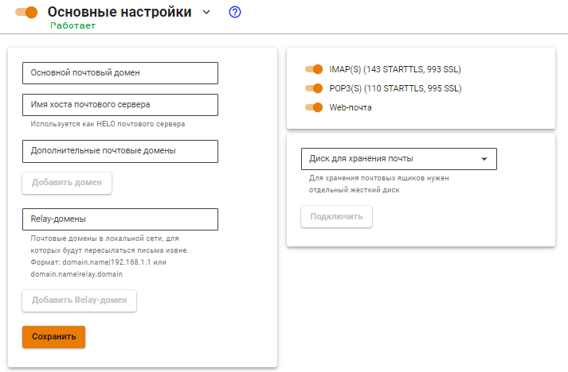

# Основные настройки


UTM не поддерживает кириллические почтовые домены.


Раздел основных настроек включает в себя множество базовых параметров, необходимых для работы почтового сервера в сети Интернет.

* **Основной почтовый домен.** Указывает серверу на его почтовый домен, для которого он должен принимать и обрабатывать письма. Все ящики пользователей будут принадлежать этому домену. От имени этого домена вы будете вести переписку с корреспондентами;
* **Имя хоста почтового сервера.** Как правило, совпадает с MX-записью для вашего домена. Это имя должно разрешаться из сети Интернет во внешний IP-адрес UTM. Используется почтовым сервером в диалоге при транспорте почты между другими почтовыми серверами как уникальный идентификатор. Необходимо для корректной работы почтового сервера в сети Интернет;
* **Дополнительные почтовые домены.** Дополнительные домены, которые почтовый сервер будет считать своими. Корреспонденция, отправляемая на адреса ящиков в этих почтовых доменах также будет обрабатываться сервером при условии правильной установки MX-записей;
* **Relay-домены.** Почтовые домены в локальной сети, для которых будут пересылаться письма извне;
*   **Диск для хранения почты.** Если вы используете почтовый сервер Ideco UTM как полноценный сервер с хранением почты, то начиная с версии 7.9.0 обязательным является хранение почты на дополнительном HDD/SSD диске. Поддерживаются только SATA/SAS накопители. Перед подключением диска - заполните поля **Основной почтовый домен** и **Имя хоста почтового сервера**, а так же включите почту.

    **Если вы подключили диск, но он не отображается, то, пожалуйста, обратитесь в техническую поддержку: по телефону +7 (495) 662-87-34 или по почте support@ideco.ru.**
* **IMAP(S) (143 STARTTLS, 993 SSL).** Задействование возможности работы с почтовыми ящиками сервера по протоколу IMAP (с шифрованием STARTTLS) из локальной сети и Интернет;
* **POP3(S) (110 STARTTLS, 995 SSL).** Задействование возможности работы с почтовыми ящиками сервера по протоколу POP3 (с шифрованием STARTTLS) из локальной сети и Интернет;
* **Web-почтa.** Включение веб-интерфейса почтового клиента для доступа к почте на сервере из локальной сети.

***

## SSL-сертификат для почтового домена

После сохранения настроек основного почтового домена и имени хоста почтового сервера Ideco UTM создает локальный сертификат, подписанный корневым (самоподписанным) сертификатом. Параллельно с созданием локального сертификата, отправляется запрос на выпуск сертификата Let’s Encrypt.

* Если сертификат Let’s Encrypt успешно выписался, то он заместит собой локальный сертификат;
* Если выпуск сертификата Let’s Encrypt завершился неудачей, то будет использоваться локальный сертификат.


Работа с сертификатами ведётся в разделе **Сервисы -> Сертификаты**.



Если вы хотите заменить автоматически выпущенный сертификат на свой, то при загрузке собственной цепочки сертификатов **CN(Общее имя)** крайнего сертификата должно соответствовать домену, для которого сертификат загружается.



Для загрузки своего сертификата на сервер вы можете воспользоваться [инструкцией](../../services/certificates/upload-ssl-certificate-to-server.md).

