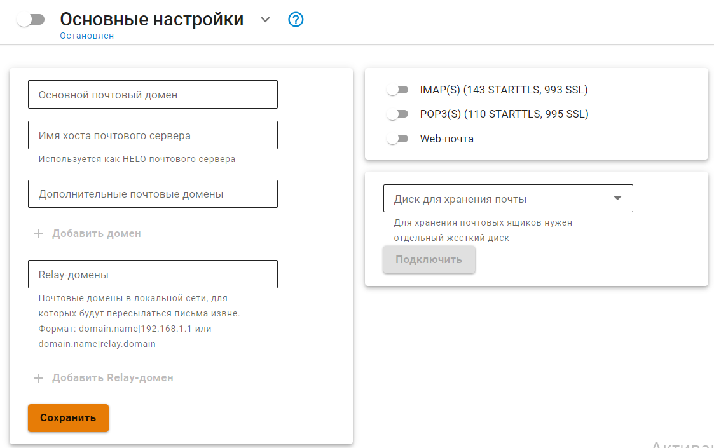

# Основные настройки


NGFW не поддерживает кириллические почтовые домены.


В разделе **Основные настройки** представлены базовые параметры, необходимые для настройки почтового сервера, почтового релея и веб-почты. 

Ideco NGFW можно настроить, как почтовый сервер, почтовый релей или воспользоваться почтовым клиентом NGFW. В зависимости от необходимой функциональности, следуйте соответствующим инструкциям:


[web-mail.md](web-mail.md)



[mail-server-settings.md](mail-server-settings.md)



[mail-relay-settings.md](mail-relay-settings.md)
