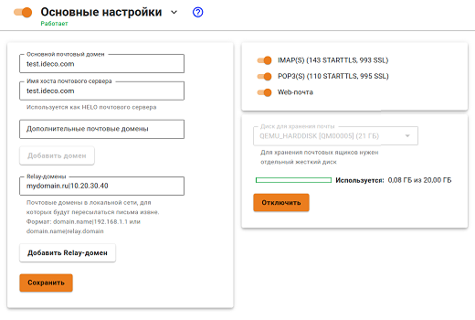

# Настройка почтового релея


UTM не поддерживает кириллические почтовые домены.


Ретрансляция входящей почты с внешнего IP-адреса Ideco UTM (с зарегистрированным доменом и настроенными записями у регистратора и провайдера) на другой сервер для отправки и доставки почты.

Перед настройкой почтового релея убедитесь что на Ideco UTM включен почтовый сервер.

Для настройки почтового релея добавьте в поле **Relay-домены** запись вида: `mydomain.ru|10.20.30.40`, где:

* `mydomain.ru` - почтовый домен, зарегистрированный в Интернете на публичный адрес Ideco UTM;
* `10.20.30.40` - адрес почтового сервера в локальной сети.

При настройке почтового релея на Ideco UTM принципиально, чтобы основной почтовый домен Ideco отличался от Relay-домена. Для этого в поле **Основной почтовый домен** в настройках почтового сервера нужно прописать вымышленный домен, не совпадающий с зарегистрированным. Таким образом можно указать несколько Relay-доменов для нескольких разных серверов в локальной сети. Все почтовые домены должны быть ассоциированы с внешним адресом сервера Ideco UTM (A и MX записи в DNS-зоне).

При такой схеме Ideco UTM будет пропускать проходящую через себя почту прямо на почтовый сервер в локальной сети. Попутно письма могут проверяться спам. Для этого включите соответствующие сервисы в веб-интерфейсе Ideco UTM.

Работа в режиме открытого почтового релея невозможна, поэтому Ideco NGFW в режиме Relay может принимать почту только в следующих случаях:

* Когда почта адресована исключительно для указанного Relay-домена;
* Из сетей, которые входят в список доверенных в разделе **Расширенные настройки -> Безопасность**.

Вся остальная почта будут отвергнута сервером.