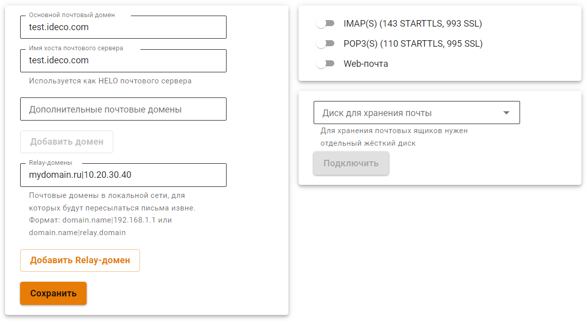
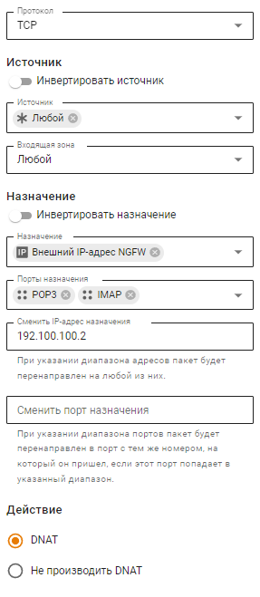

# Настройка почтового релея


UTM не поддерживает кириллические почтовые домены.


Ретрансляция входящей почты с внешнего IP-адреса Ideco UTM (с зарегистрированным доменом и настроенными записями у регистратора и провайдера) на другой сервер для отправки и доставки почты.

Перед настройкой почтового релея убедитесь что на Ideco UTM включен почтовый сервер.

Для настройки почтового релея:

1\. Добавьте в поле **Relay-домены** запись вида: `mydomain.ru|10.20.30.40`, где:

* `mydomain.ru` - почтовый домен, зарегистрированный в Интернете на публичный адрес Ideco UTM;
* `10.20.30.40` - адрес почтового сервера в локальной сети.

**Важно!** Основной почтовый домен Ideco должен отличаться от Relay-домена. Для этого в поле **Основной почтовый домен** в настройках почтового сервера нужно прописать вымышленный домен, не совпадающий с зарегистрированным.

2\. Перейдите в раздел **Правила трафика -> Файрвол -> DNAT** и создайте правило проброса портов POP3 и IMAP:

Все почтовые домены должны быть ассоциированы с внешним адресом сервера Ideco UTM (A и MX записи в DNS-зоне).

Ideco NGFW будет принимать почту, адресованную только для указанного Relay-домена. Любая другая почта будет отвергнута сервером. Работа в режиме открытого почтового релея невозможна.
