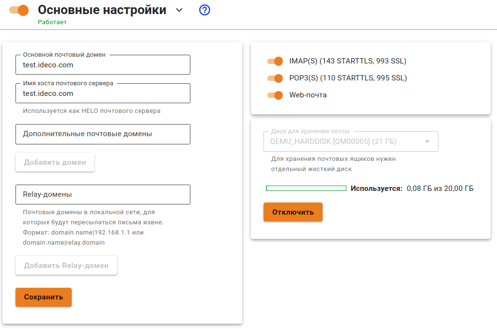

# Настройка почтового сервера

1\. Перейдите в раздел **Почтовый релей -> Основные настройки**, заполните поля **Основной почтовый домен** и **Имя хоста почтового сервера**.

* **Основной почтовый домен** указывает серверу на его почтовый домен, для которого он должен принимать и обрабатывать письма. Все ящики пользователей будут принадлежать этому домену. От имени этого домена будет вестись переписка с корреспондентами.
* **Имя хоста почтового сервера** должно разрешаться из сети интернет во внешний IP-адрес UTM. Почтовый сервер использует это имя как уникальный идентификатор при транспорте почты между другими почтовыми серверами. Необходимо для корректной работы почтового сервера в интернете.


Имя хоста почтового сервера как правило, совпадает с MX-записью для вашего домена.


2\. Заполните дополнительные почтовые домены, которые почтовый сервер будет считать своими. Корреспонденция, отправляемая с ящиков в этих почтовых доменах, будет обрабатываться сервером при условии правильной установки MX-записей.

3\. Включите опции IMAP(S) и POP(S).

4\. Подключите дополнительный жесткий диск к серверу, если Ideco UTM планируется использовать, как полноценный сервер с хранением почты.

Хранение почты на дополнительном HDD/SSD-диске обязательно, начиная с версии Ideco UTM 7.9.0. Поддерживаются только SATA/SAS-накопители. Перед подключением диска включите почту.

**Если вы подключили диск, но он не отображается, обратитесь в [техническую поддержку](../../../general/technical-support.md).**

## SSL-сертификат для почтового домена

После сохранения настроек основного почтового домена и имени хоста почтового сервера Ideco UTM создает локальный сертификат, подписанный корневым (самоподписанным) сертификатом. Параллельно с созданием локального сертификата, отправляется запрос на выпуск сертификата Let’s Encrypt.

* Если сертификат Let’s Encrypt успешно выпущен, то он заменит собой локальный сертификат.
* Если выпуск сертификата Let’s Encrypt завершился неудачей, то будет использоваться локальный сертификат.


Для замены автоматически выпущенного сертификата перейдите в раздел **Сервисы -> Сертификаты -> Загруженные сертификаты** и загрузите собственную цепочку сертификатов. **CN (Общее имя)** последнего сертификата в цепочке должно соответствовать домену, для которого сертификат загружается. Подробнее в [инструкции](../../services/certificates/upload-ssl-certificate-to-server.md).


## Проверка настроек почтового сервера

Рекомендуется проверить корректность всех настроек DNS и почтового сервера с помощью сервиса [mail-tester.com](https://www.mail-tester.com/).

При правильной настройке почтовый сервер на Ideco UTM должен получить 10 баллов из 10.
