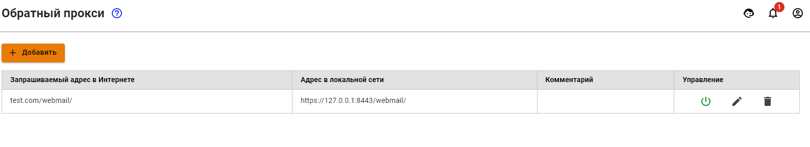
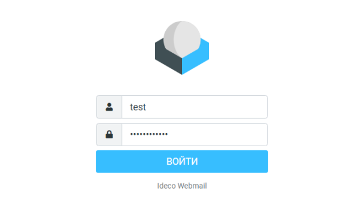
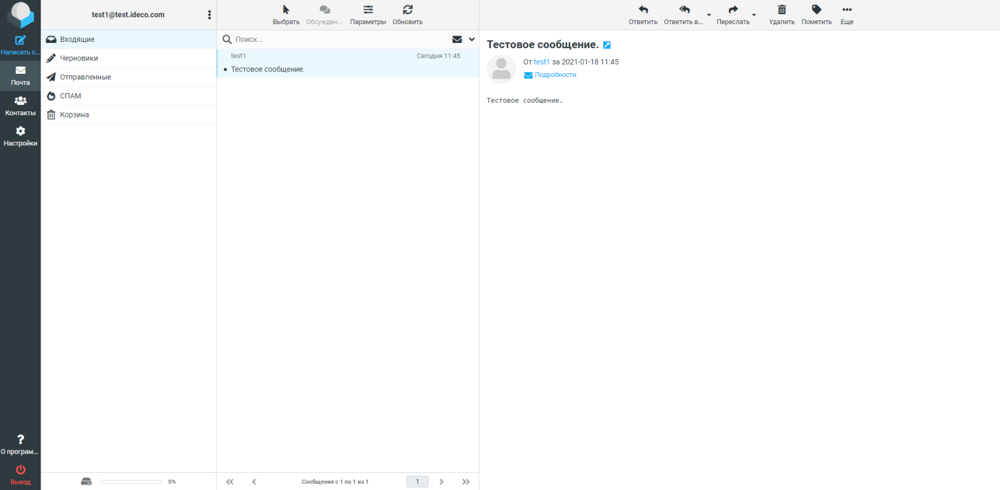

# Web-почта

1\. Для работы веб-почты на локальном интерфейсе необходимо активировать настройку **Web-почта** в разделе **Почтовый релей -> Основные настройки**.

2\. Для работы на внешнем интерфейсе нужно создать правило в разделе **Сервисы -> Обратный прокси:**

**Пример правила для доступа по доменному имени и по IP-адресу:**

После создания правила из локальной сети в браузере наберите: **`https://х.х.х.х:8443/webmail/`**, где `х.х.х.х` - адрес локального интерфейса.

Из сети интернет наберите в браузере: **`https://[доменное_имя]/webmail/`**. Например: **`https://test.com/webmail/`**

Менее приоритетный альтернативный вариант: из сети интернет наберите в браузере: **`https://x.x.x.x/webmail/`**, где `x.x.x.x` - адрес внешнего интерфейса.\
Например: **`https://66.77.88.99/webmail/`**


**Для подключения обязательно использовать HTTPS.**


* В открывшейся форме входа в почтовый ящик в качестве логина укажите логин от учетной записи пользователя;
* В качестве пароля всегда прописывается пароль от учетной записи пользователя. **Установить отдельный пароль на почту нельзя.**

При успешном входе в браузере откроется веб-интерфейс почтового ящика пользователя:

Веб-интерфейс встроенного почтового клиента работает с почтовым сервером по протоколу IMAP и обладает возможностями:

* Создание и отправка писем. Поддерживается загрузка множественных вложений;
* Просмотр, удаление, перемещение письма. Управление IMAP-папками ящика;
* Персональная (для конкретного ящика) адресная книга, работающая только в рамках веб-приложения;
* Адресная книга поддерживает формат контактов VCARD и может быть экспортирована или сохранена на вашем компьютере;
* Календарь с возможностью создавать события и уведомлять о них сотрудников по почте;
* Цветные метки писем, как это принято в почтовом клиенте Thunderbird. Проставляются клавишами от 1 до 5. Изменения сохраняются на сервере, поэтому в другом почтовом клиенте метки будут видны;
* Расширенный поиск по всем письмам ящика находится в разделе **Еще...** панели инструментов ящика.
