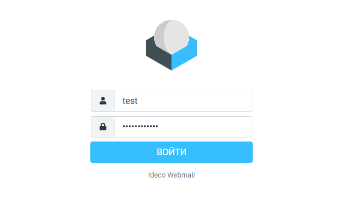
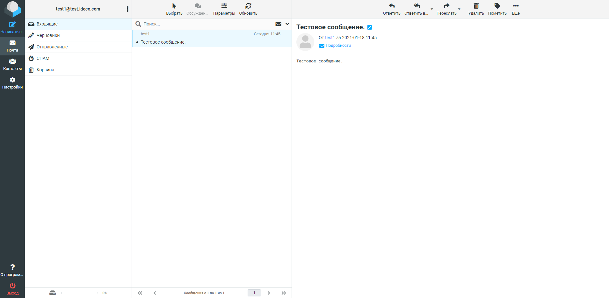

# Web-почта

1. Для работы веб-почты на локальном интерфейсе необходимо активировать настройку **Web-почта** в разделе **Почтовый релей -&gt; Основные настройки**. 
2. Для работы на внешнем интерфейсе нужно создать правило в разделе **Сервисы -&gt; Обратный прокси**.

Когда все настройки произведены, из локальной сети в браузере наберите `https://192.168.0.1:8443/webmail`, где 192.168.0.1 - адрес локального интерфейса. Из сети Интернет наберите в браузере `https://66.77.88.99/mail`, где 66.77.88.99 - адрес внешнего интерфейса. **Для подключения обязательно использовать HTTPS.**

* В открывшейся в вашем браузере форме входа в почтовый ящик в качестве логина укажите логин от учётной записи пользователя.
* В качестве пароля всегда прописывается пароль от учётной записи пользователя. **Сделать отдельный пароль на почту нельзя.**

При успешном входе в браузере откроется веб-интерфейс почтового ящика пользователя:

Веб-интерфейс встроенного почтового клиента работает с почтовым сервером по протоколу IMAP и обладает следующими возможностями:

* Создавать и отправлять письма. Поддерживается загрузка множественных вложений.
* Просматривать, удалять, перемещать письма. Управлять IMAP-папками ящика.
* Глобальная и персональная \(для конкретного ящика\) адресные книги, работающие только в рамках веб-приложения.
* Адресная книга поддерживает формат контактов VCARD и может быть экспортирована или сохранена на вашем компьютере в этом формате.
* Календарь с возможностью создавать события и уведомлять о них сотрудников по почте.
* Цветные метки писем, как это принято в почтовом клиенте Thunderbird. Проставляются клавишами от 1 до 5. Изменения сохраняются на сервере так, что в другом почтовом клиенте метки будут видны.
* Гибкий расширенный поиск по всем письмам ящика. Находится в разделе **Еще...** панели инструментов ящика.

