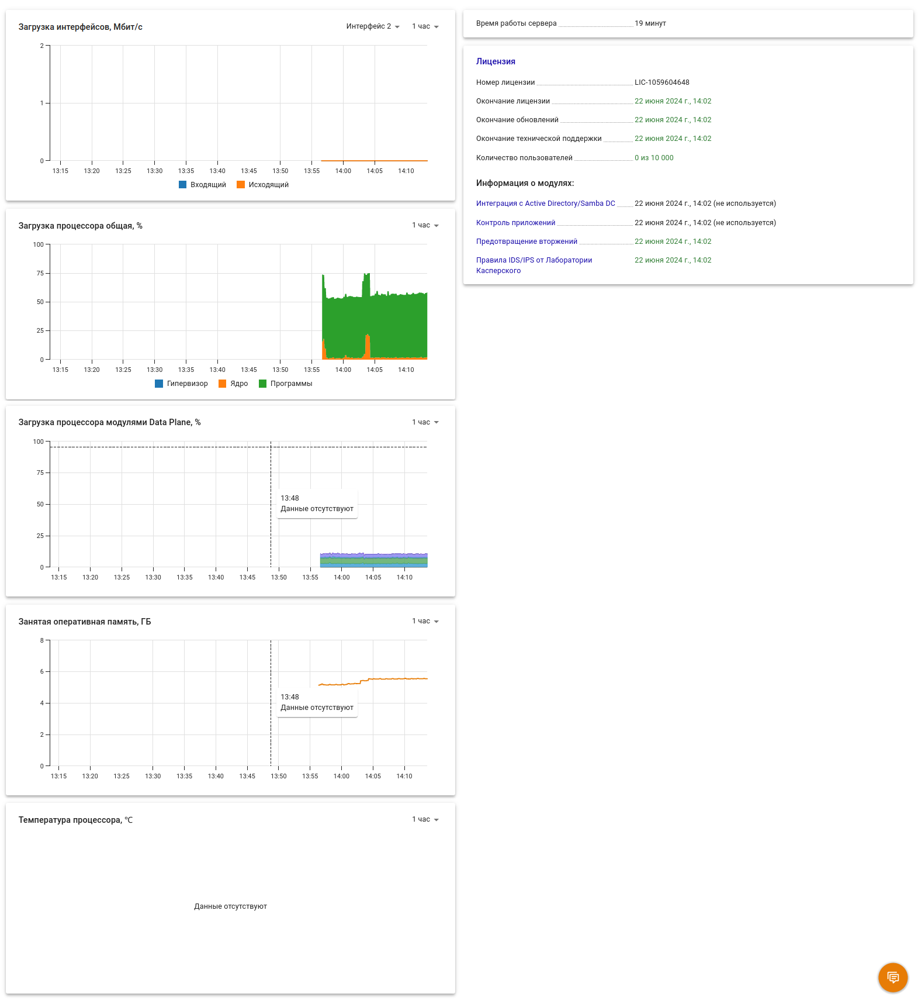

# Панель мониторинга

Данный модуль позволяет просматривать некоторую информацию о состоянии сервера:

* время работы сервера;
* основная информация о [лицензии](../service/license-management.md); 
* загрузка процессора за определенное время \(5 мин, час, 6 часов, день, 7 дней\);
* оперативная память;
* температура сервера за определенное время;
*  управление модулями фильтрации \(вы можете включить или отключить нужные вам модули\).

Пример окна модуля **Панель мониторинга** представлен на скриншоте ниже:

