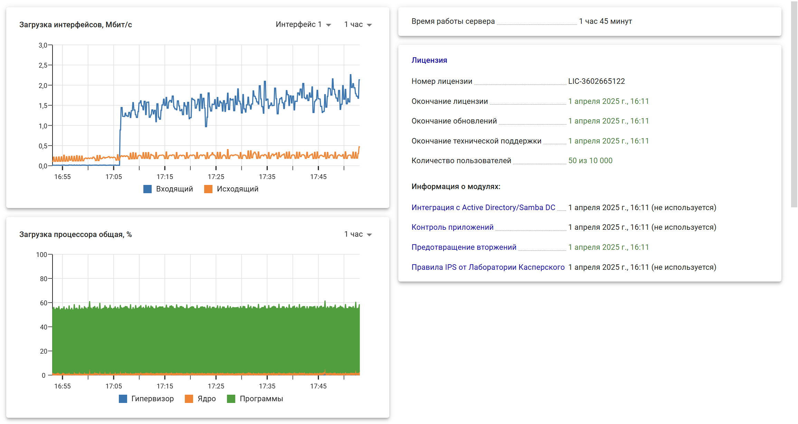

# Панель мониторинга

Данный модуль позволяет просматривать некоторую информацию о состоянии сервера:

* Время работы сервера;
* Основная информация о [лицензии](../service/license-management.md);
* Загрузка процессора за определенное время (5 мин, час, 6 часов, 1 день, 7 дней);
* Занятая оперативная память;
* Управление модулями фильтрации (можно включить или отключить нужные модули);
* Загрузка интерфейсов по определенному интерфейсу за определенное время;
* Топ 5 хостов (входящая скорость);
* Топ 5 хостов (исходящая скорость);
* IPsec (исходящие подключения);
* IPsec (входящие подключения).

Пример окна модуля **Панель мониторинга** представлен на скриншоте ниже:

