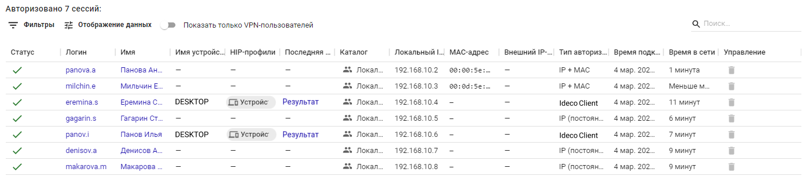
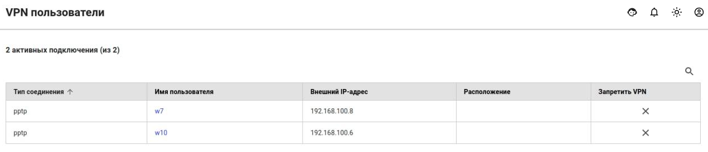

# Авторизованные пользователи и VPN пользователи

В разделе **Мониторинг -> Авторизованные пользователи** отображен список всех сессий пользователей, которые авторизовались в UTM.

| Статус                                          | Описание |
| ----------------------------------------------- | --------------------------------------------------- |
|   | **Подключено**. Пользователь авторизован |
|  | **Ожидает второй фактор авторизации**. Пользователь создал и активировал VPN-подключение, но не прошел двухфакторную аутентификацию (подробнее в [статье](../users/two-factor-authentication.md)) |
|  | **Превышен лимит лицензии**. Данная сессия заблокирована. Появляется в случае, если превышено количество  пользователей по лицензий или у пользователя уже есть активные 5 сессий |
|  | **Сессия удаляется**. Появляется в случае, если была разорвана сессия с динамическим IP-адресом. Сессия с таким статусом будет удалена через 30 секунд |

Пример таблицы с авторизованными разными способами пользователями представлен на скриншоте ниже:

В столбце **Управление** можно разавторизовать пользователя при необходимости.

## VPN пользователи

В разделе **Мониторинг -> VPN пользователи** отображен список всех пользователей, у которых в [настройках пользователя](../users/user-tree/customization-of-users.md#kategoriya-osnovnoe) отмечен пункт **Разрешить удаленный доступ по VPN**.

Пример таблицы с пользователями подключенными по VPN представлен на скриншоте ниже:

Если в столбце **Запретить VPN** нажать кнопку , то UTM запретит этому пользователю VPN-подключение и снимет флаг **Разрешить удалённый доступ через VPN** в разделе **Пользователи -> Учетные записи**
