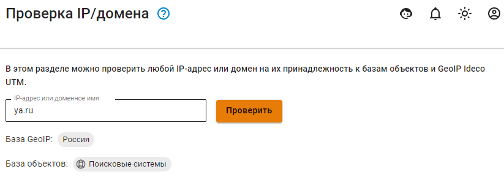

# Проверка IP/домена

Для проверки в соответствующей строке введите IP-адрес или доменное имя. Поиск производится в базе GeoIP и базе объектов. Результатом поиска будет страна, в которой зарегистрирован поисковой запрос, и список объектов, в значении которых указан поисковой запрос.

