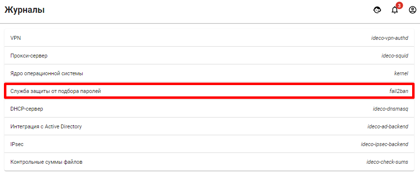

# Журналы


Ideco UTM хранит и показывает логи в течении 24 часов.


В разделе можно просматривать логи работы следующих служб:

* VPN-авторизация пользователей;
* Прокси-сервер;
* Ядро операционной системы;
* Служба защиты от подбора паролей \([как сбросить блокировки по IP см.](logs.md#zashita-ot-bruteforce-atak) \);
* DHCP-сервер;
* Журнал службы интеграции с доменом - Интеграция с Active Directory;
* IPSec.

Для того чтобы просмотреть логи конкретной службы, нажмите правой кнопкой мыши на строку с названием этой службы.

---
## Защита от bruteforce-атак

После 6-ти неудачных попыток ввода пароля в течение 15 минут, IP-адрес подбирающего блокируется на 45 минут.

Модуль не настраивается в веб-интерфейсе.

Посмотреть логи работы службы можно в веб-интерфейсе во вкладке **Мониторинг -&gt; Журналы -&gt; Служба защиты от подбора паролей**. Либо на вкладке **Терминал**, введя команду `journalctl -u fail2ban`.

Сбросить блокировки можно из локального меню шлюза: **Правила доступа -&gt; Сбросить блокировки по IP**.

