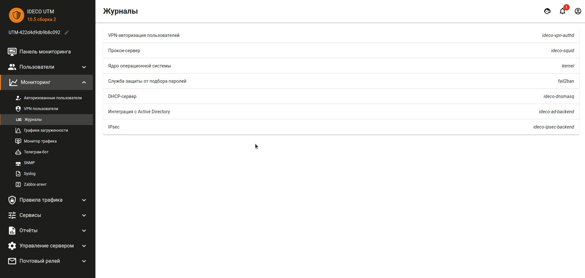

# Журналы

В разделе можно просматривать логи работы следующих служб:

* VPN-авторизация пользователей;
* Прокси-сервер;
* Ядро операционной системы;
* Служба защиты от подбора паролей \(как сбросить блокировки по IP см. в [статье](../access-rules/fail2ban.md)\);
* DHCP-сервер;
* Журнал службы интеграции с доменом - Интеграция с Active Directory;
* IPSec.

Для того чтобы просмотреть логи конкретной службы, нажмите правой кнопкой мыши на строку с названием этой службы.

