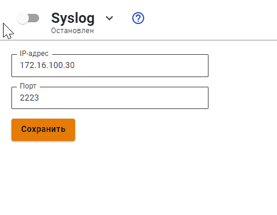

# Syslog


Название службы раздела **Syslog**: `ideco-monitor-backend.service`. \
Список служб для других разделов доступен по [ссылке](../server-management/terminal.md).


## Пересылка системных сообщений

В качестве коллектора можно указывать любой локальный «серый» или публичный «белый» IP-адрес.

В поле **Порт** укажите любой порт из диапазона от 1 до 65535.




Передача системных сообщений происходит согласно RFC-5424 (транспорт UDP).


## Расшифровка передаваемых логов

<details>

<summary>Предотвращение вторжений</summary>


```
192.168.100.2	Dec 14 15:48:38		daemon	warning		timestamp:2022-12-14 10:48:34.808465+00:00,flow_id:1189034483406353,in_iface:seq:Leth1:3:m,sensor_name:suricata_debug,event_type:alert,src_ip:192.168.100.11,src_port:61790,src_country:,src_country_code:,src_session_uuid:7100d1c8-017f-4cbf-8b78-482839300211,src_user_id:2,src_user_name:a.istomina,dest_ip:192.168.100.2,dest_port:53,dest_country:,dest_country_code:,dest_session_uuid:,dest_user_id:-1,dest_user_name:,proto:UDP,alert.signature_id:1003892,alert.signature:Windows Telemetry,alert.category:Telemetry Windows,alert.severity:3,alert.gid:1,alert.action:blocked,http.hostname:,http.url:,http.http_user_agent:,flow.pkts_toserver:1,flow.pkts_toclient:0,flow.bytes_toserver:73,flow.bytes_toclient:0,flow.start:2022-12-14 10:48:34.808465+00:00,flow.end:2022-12-14 10:48:35.580143+00:00,flow.age:0,flow.state:,flow.reason:,flow.alerted:0,tcp.tcp_flags:,tcp.tcp_flags_ts:,tcp.tcp_flags_tc:,tcp.cwr:0,tcp.ecn:0,tcp.urg:0,tcp.ack:0,tcp.psh:0,tcp.rst:0,tcp.syn:0,tcp.fin:0,tcp.state:
```


где:
* **192.168.100.2** - ip-адрес UTM отправителя;
* **Dec 14 15:48:38** - время получения события по Syslog;	
* **timestamp:** 2022-12-14 10:48:34.808465+00:00 - время события в системе предотвращения вторжений, может не совпадать с временем получения события по Syslog;
* **flow_id:** 1189034483406353- внутренний идентификатор системы предотвращения вторжений flow(сессии);
* **in_iface:** seq:Leth1:3:m - содержит идентификатор входящего интерфейса;
* **sensor_name:** suricata_debug - имя экземпляра системы предотвращения вторжений;
* **event_type:** alert - тип события;
* **src_ip:** 192.168.100.11 - IP-адрес источника;
* **src_port:** 61790 - порт источника;
* **src_country:** - название местоположения источника;
* **src_country_code:** - ISO-код страны источника;
* **src_session_uuid:** 7100d1c8-017f-4cbf-8b78-482839300211 - внутренний идентификатор сессии Ideco UTM источника;
* **src_user_id:** 2 - идентификатор пользователя источника;
* **src_user_name:** a.istomina- имя пользователя источника;
* **dest_ip:** 192.168.100.2 - IP-адрес назначения;
* **dest_port:** 53 - порт назначения;
* **dest_country:** - название местоположения назначения;
* **dest_country_code:** - ISO-код страны назначения;
* **dest_session_uuid:** - внутренний идентификатор сессии Ideco UTM назначения;
* **dest_user_id:** -1 - идентификатор пользователя назначения;
* **dest_user_name:** - имя пользователя назначения;
* **proto:** UDP - протокол;
* **alert.signature_id:** 1003892 - ID правила системы предотвращения вторжений;
* **alert.signature:** Windows Telemetry - сообщение из сработавшего правила;
* **alert.category:** Telemetry Windows - описание колонки в веб-интерфейсе События безопасности; \
  Соответствие *alert.category:* -> *alert.signature* описаны в [файле](https://static.ideco.ru/static/alert.category%20-%20alert.signature.pdf).
* **alert.severity:** 3 - уровень угрозы, может принимать значения 1, 2, 3 и 256, где 1 - самый высокий уровень угрозы;| Обновления Cisco | Cisco Updates,Cisco Updates |


Служебные поля результата анализа HTTP-трафика. Заполняются в случае, если в процессе анализа трафика был определен HTTP-протокол:
* **http.hostname:** - идентификатор хоста;
* **http.url:** - url на который велось обращение;
* **http.http_user_agent:** - информация, идентифицирующая HTTP-клиента.
  
Служебные поля flow(сессии):
* **flow.pkts_toserver** :1 - количество пакетов, переданное от клиента к серверу;
* **flow.pkts_toclient:** 0 - количество пакетов, переданное от сервера к клиенту;
* **flow.bytes_toserver:** 73 - количество байт, переданное от клиента к серверу;
* **flow.bytes_toclient:** 0 - количество байт, переданное от сервера к клиенту;
* **flow.start:** 2022-12-14 10:48:34.808465+00:00 - начало;
* **flow.end:** 2022-12-14 10:48:35.580143+00:00 - окончание;
* **flow.age:** 0 - возраст;
* **flow.state:** - текущее состояние;
* **flow.reason:** - запущена ли IPsec в режиме отладки;
* **flow.alerted:** 0 - сгенерировался ли поток alert;

Состояние флага [TCP flow(сессии)](https://ru.wikipedia.org/wiki/Transmission_Control_Protocol#%D0%A4%D0%BB%D0%B0%D0%B3%D0%B8_(%D1%83%D0%BF%D1%80%D0%B0%D0%B2%D0%BB%D1%8F%D1%8E%D1%89%D0%B8%D0%B5_%D0%B1%D0%B8%D1%82%D1%8B)): 
* **tcp.tcp_flags:** - значение поля flags в заголовке TCP;
* **tcp.tcp_flags_ts:** -  [timestamp флаги](https://www.atraining.ru/windows-network-tuning/#:~:text=TCP%20Timestamps%20–%20базовая%20низкоуровневая,не%20может%20высчитать%20данные%20значения);
* **tcp.tcp_flags_tc:** - [флаг Truncated response](https://www.rfc-editor.org/rfc/rfc5966);
* **tcp.cwr:** 0;
* **tcp.ecn:** 0;
* **tcp.urg:** 0;
* **tcp.ack:** 0;
* **tcp.psh:** 0;
* **tcp.rst:** 0;
* **tcp.syn:** 0;
* **tcp.fin:** 0;
* **tcp.state:** - [состояния сеанса TCP](https://ru.wikipedia.org/wiki/Transmission_Control_Protocol#Состояния_сеанса_TCP).

</details>

<details>

<summary>Файрвол</summary>


```
ноя 24 09:36:27 localhost ideco-nflog[691]: UDP      src 192.168.100.12   sport 137   dst 40.125.122.151   dport 137   table FWD  rule  1    action accept
```


* **UDP** - протокол, принимает значения UDP, TCP, ICMP, GRE, ESP и AH;
* **src** - IP-адрес источника;
* **dst** -  IP-адрес назначения;
* **sport** - порт источника для UDP и TCP;
* **dport** - порт назначения для UDP и TCP;
* **table** - таблица правил, в которой произошло логирование;
* **rule** - ID правила из таблицы *rule*;
* **action** - действие, которое произошло.

</details>

<details>

<summary>Контроль приложений</summary>


```
192.168.100.2	Jan 12 11:00:15	1	user	err		2023-01-12T11:00:14+05:00 localhost app-control 2027 - - (flow_info_rules_was_checked) 192.168.100.11:52514 -> 192.168.100.2:53 [Amazon] = 'DROP'. 
```


* **2027** - идентификатор процесса;
* **192.168.100.11:52514** - ip-адрес источника;
* **192.168.100.2:53 [Amazon]** = 'DROP' - результат анализа трафика, где  *[Amazon]* название приложения, к которому был применен результат. [Список всех приложений](https://static.ideco.ru/static/app_control.pdf).

</details>

<details>

<summary>Контент-фильтр</summary>

Просмотр логов доступен в веб-интерфейсе в разделе **Мониторинг -> Журналы**. Название служб для фильтрации: ideco-content-filter-backend и squid ().

Пример блокировки ресурса:


```
192.168.101.130    Mar 31 14:56:57    1    daemon    info        2023-03-31T14:56:56+05:00 localhost squid 5950 - - 192.168.101.131 - - [31/Mar/2023:14:56:56 +0500] "GET https://www.igromania.ru/? HTTP/1.1" 403 7455 "https://yandex.ru/" "Mozilla/5.0 (X11; Ubuntu; Linux x86_64; rv:109.0) Gecko/20100101 Firefox/111.0" TCP_DENIED:HIER_NONE "Custom deny 8 Игры extended.id.21 group.id.1 " 
```


* **5950** - идентификатор процесса;
* **192.168.101.131** - IP-адрес пользователя;
* **[31/Mar/2023:14:56:56 +0500] "GET https://www.igromania.ru/? HTTP/1.1**:
  * **[31/Mar/2023:14:56:56 +0500]** - дата/время события блокировки;
  * **GET** - метод;
  * **https://www.igromania.ru/?** - URL заблокированного ресурса;
  * **HTTP/1.1** - протокол; 
* **403** - код состояния HTTP;
* **7455** - передано байт (в ответ, включая HTTP заголовок);
* **https://yandex.ru/** - [HTTP referer](https://ru.wikipedia.org/wiki/HTTP_referer);
* **Mozilla/5.0 (X11; Ubuntu; Linux x86_64; rv:109.0) Gecko/20100101 Firefox/111.0** - цифровой отпечаток браузера; 
* **TCP_DENIED:HIER_NONE** - техническое сообщение от [squid](http://wiki.squid-cache.org/SquidFaq/SquidLogs#Squid_result_codes);
* **Custom deny 8 Игры extended.id.21 group.id.1**:
  * **Custom deny 8 Игры** - описание и номер правила блокировки;
  * **extended.id.21** - категория сайта;
  * **group.id.1** - значение поля **Применяется для** в сработавшем правиле.

</details>

<details>

<summary>Аутентификация через веб-интерфейс</summary>


```
192.168.100.2	Jan 12 11:02:15	1	daemon	info		2023-01-12T11:02:14+05:00 localhost fail2ban.filter 779 - - INFO [utm-web-interface] Found 192.168.100.1 - 2023-01-12 11:02:14 
192.168.100.2	Jan 12 11:02:36	1	daemon	notice		2023-01-12T11:02:35+05:00 localhost fail2ban.actions 779 - - NOTICE [utm-web-interface] Ban 192.168.100.1 

```


* **info** или **notice** - приоритет сообщения в логах в виде информационного сообщения или уведомления;
* **779** - идентификатор процесса;
* **INFO [utm-web-interface] Found 192.168.100.1 - 2023-01-12 11:02:14** - факт обнаружения правил безопасности с указанием группы правил ([utm-web-interface]), ip-адреса и дата/время. Список групп правил: 
  * utm-dovecot;
  * utm-postfix-connrate.conf;
  * utm-postscreen-prgrt.conf; 
  * utm-reverse-proxy.conf;
  * utm-roundcube.conf;
  * utm-smtp.conf;
  * utm-ssh.conf;
  * utm-two-factor-codes.conf;
  * utm-vpn-authd.conf;
  * utm-vpn-pppoe-authd.conf;
  * utm-web-interface.conf;
  * utm-wireguard-backend.conf.
* **NOTICE [utm-web-interface] Ban 192.168.100.1** - факт блокировки или разблокировки ip-адреса, где:
  * **Ban** - факт блокировки;
  * **Unban** - факт разблокировки.

</details>

<details>

<summary>Подключение по VPN</summary>


```
192.168.100.2	Jan 12 11:10:06	1	local0	info		2023-01-12T11:10:05+05:00 localhost ideco-vpn-authd 1356 - - Start vpn authorization ('user_1', '192.168.100.11', 'pptp'). 
192.168.100.2	Jan 12 11:10:06	1	local0	info		2023-01-12T11:10:05+05:00 localhost ideco-vpn-authd 1356 - - Subnet 10.128.187.17/32 is authorized as user 'user_1'. Connection made from '192.168.100.11', type 'pptp'.
```


* **1356** - идентификатор процесса;
* **Start vpn authorization**('user_1', '192.168.100.11', 'pptp') - факт запроса на авторизацию с информацией о запрашиваемом подключении, где:
  *  **user_1** - логин пользователя; 
  *  **192.168.100.11** - ip-адрес, откуда установлено подключение;
  *  **pptp** - протокол.
* **Subnet 10.128.187.17/32** - факт успешной авторизации с локальным ip-адресом.

</details>

