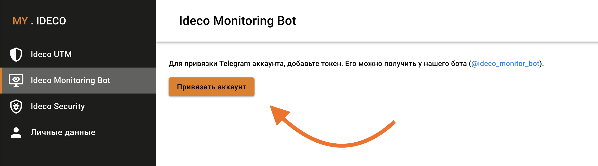

# Telegram-бот

Бот может отправлять оповещения:

* в личные сообщения,
* в беседы, где 2 и более пользователей \(groups\).

## Привязка Ideco Monitоring Bot

1. Настроить Интернет на Ideco UTM.
2. [Привязать лицензию](../../service/license-management.md#upravlenie-licenziyami) к серверу.
3. Перейти к диалогу с ботом: [@ideco\_monitor\_bot](https://t.me/ideco_monitor_bot?command=start).
4. Написать боту `/start`.
5. Скопировать код привязки к аккаунту.
6. Перейти в раздел **Ideco Monitoring Bot** в [личном кабинете](https://my.ideco.ru/#/ideco-monitoring-bot).
7. Нажать на кнопку **Привязать аккаунт**.
8. Ввести код в соответствующее поле и нажать на кнопку **Привязать**.


Уведомления начнут приходить в ваш Telegram аккаунт.


## Настройка оповещений Ideco Monitоring Bot

Вы можете настраивать оповещения, которые приходят от Ideco Monitoring Bot. Настраивать оповещения можно для каждой отдельной беседы.

Чтобы настроить оповещения, перейдите в раздел настройки, нажав на иконку . Проставьте галочки напротив тех уведомлений, которые хотели бы получать в выбранной беседе.


Если вы хотите временно отключить отправку уведомлений, нажмите на иконку . Оповещение перестанут приходить, пока вы снова не нажмете на эту иконку.

