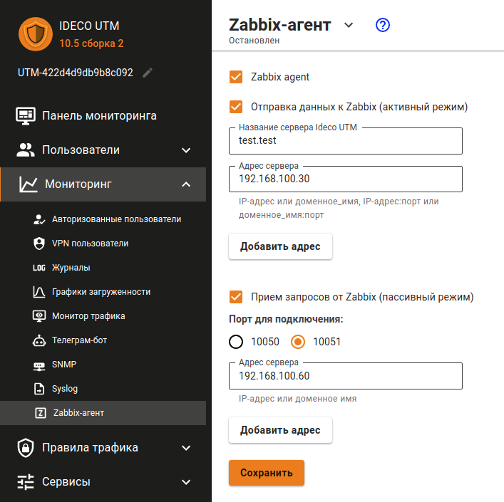

# Интеграция с Zabbix

Zabbix - это решение асса с открытыми исходными кодами.

Ознакомиться с Zabbix, можно на [официальной странице Zabbix](https://www.zabbix.com/ru/).

Опробуйте Zabbix в виде [готового решения](https://www.zabbix.com/documentation/6.2/en/manual/appliance) или установить его, воспользовавшись [документацией Zabbix](https://www.zabbix.com/documentation/current/en/manual).

## Интеграция с Zabbix


Для работы системы мониторинга Zabbix активируйте опцию **Zabbix агент** после настройки интеграции с Zabbix.


Интеграция с системой мониторинга Zabbix возможна в двух режимах:

1. **Активный режим** - соединение с Zabbix-сервером происходит со стороны Ideco NGFW. Для настройки этого режима заполните следующие поля:
   * **Имя сервера Ideco NGFW** - имя, которое будет отображаться на сервере мониторинга;
   * **Адрес сервера** - IP-адрес, доменное имя, либо IP-адрес:порт, доменное имя:порт в случаях, если используется не стандартный для Zabbix входящий порт. Для добавления еще одного адреса нажмите на кнопку **Добавить адрес**.
2. **Пассивный режим** - подключение происходит со стороны Zabbix-сервера. Для настройки этого режима заполните следующие поля:
   * **Порт для подключения** - выберите 10050 или 10051 порт;
   * **Адрес сервера** - IP-адрес или доменное имя Zabbix-серверов. Для добавления еще одного адреса нажмите на кнопку **Добавить адрес**.

В обоих случаях интеграции Zabbix-сервер должен находиться внутри локальной сети Ideco NGFW. Подключение мониторинга возможно только к локальным интерфейсам.


В качестве шаблонов данных можно использовать стандартные шаблоны для Linux-серверов.

