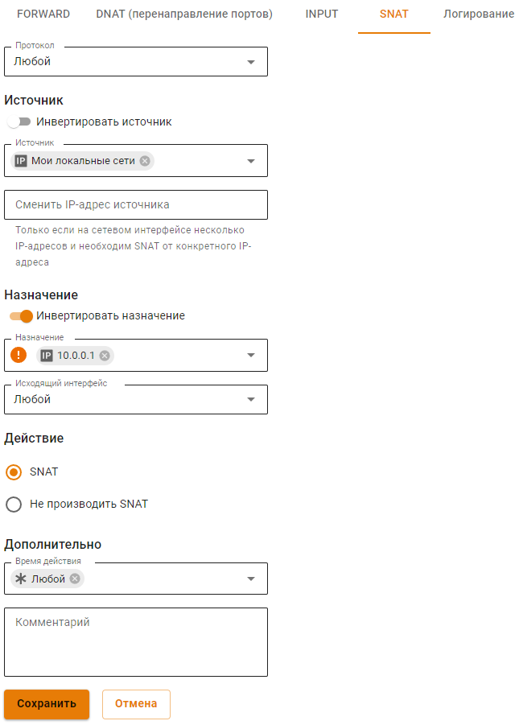

# Доступ из внешней сети без NAT

## Доступ из локальной сети во внешнюю без NAT

При необходимости (как правило, когда Ideco NGFW расположен внутри локальной сети, а не на границе с интернетом) возможно организовать прямой доступ к некоторым ресурсам внешних по отношению к Ideco NGFW сетей без использования NAT.

Для примера разберем настройку файрвола для доступа без NAT к IP-адресу: **10.0.0.1** (в общем случае это также может быть сеть или диапазон IP-адресов).

1\. Выключите параметр **Автоматический SNAT локальных сетей** в **Правила трафика -> Файрвол**.

2\. В файрволе в таблице SNAT создайте правило:

* **Источник** - объект нужной локальной сети;
* **Назначение** - 10.0.0.1;
* **Действие** - SNAT;
* **Инвертировать назначение** - переведите в положение *Включен*, **чтобы не производить SNAT** при выбранном действии **SNAT**.

**Итоговое правило файрвола выглядит так:**


На устройствах локальной сети Ideco NGFW должен использоваться в качестве основного шлюза, либо должен быть прописан необходимый маршрут к внешним IP-адресам через Ideco NGFW. Также устройства локальной сети должны быть авторизованы на NGFW. На устройствах из внешней сети (по-отношению к Ideco NGFW) Ideco NGFW также должен использоваться в качестве основного шлюза, либо должен иметься маршрут к локальной сети через Ideco NGFW.


## Доступ из внешней сети в локальную без NAT и фильтрации


Внимание! Учитывайте риски подобного доступа с точки зрения информационной безопасности. Не предоставляйте доступ для сетей и хостов, в безопасности которых не уверены.


При необходимости можно разрешить доступ с хостов или из сетей, расположенных во внешней относительно Ideco NGFW сети, в локальную сеть с прямым обращением к локальным IP-адресам.

Для примера разберем настройку файрвола разрешающую хосту 10.0.0.1 доступ к локальной сети.

1\. В консоли NGFW ([доступ по SSH](../server-management/admins.md)) ввести команду:

`nano /usr/bin/ideco-firewall-static`

2\. Между строками:

`iptables -A FORWARD -m state --state INVALID -j smart_drop`

`iptables -A FORWARD -j forward_sys_rules`

Вписать строки:

`iptables -A FORWARD -d 10.0.0.1 -j ACCEPT`

`iptables -A FORWARD -s 10.0.0.1 -j ACCEPT`

3\. Сохраните файл

4\. Перезагрузите Ideco NGFW


Внимание! После обновления Ideco NGFW в некоторых случаях процедуру этой ручной настройки придется повторить.

