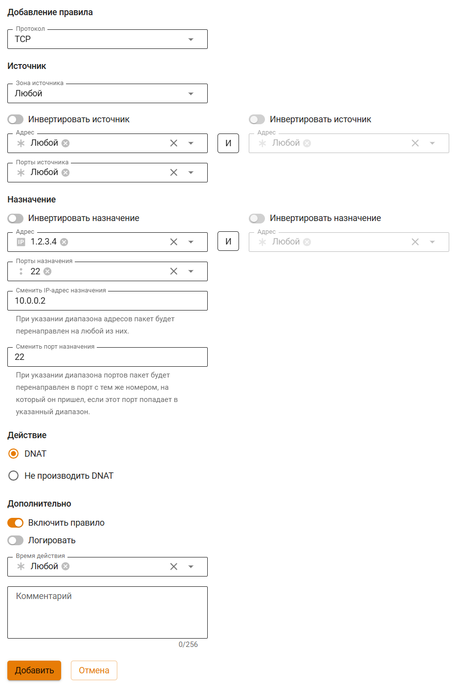
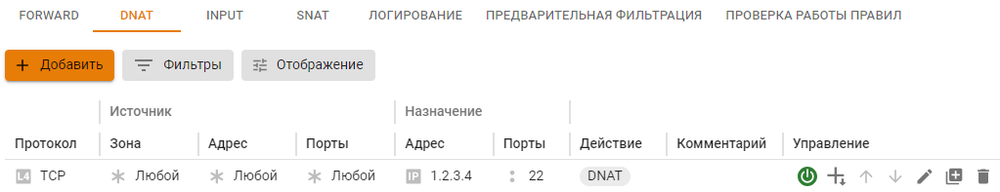

# Портмаппинг (проброс портов, DNAT)

Часто нужно настроить сервер таким образом, чтобы он предоставлял доступ к сетевой службе, работающей на сетевом устройстве в локальной сети с приватным (серым) IP-адресом, то есть опубликовать сервис (или сетевую службу) в интернете.

Публикация службы, доступной в локальной сети, работает путем трансляции (проброса) любого неиспользуемого сетевого порта на внешнем (публичном) IP-адресе сервера Ideco NGFW на порт соответствующего сервиса, работающего на сетевом устройстве в локальной сети.

При этом все обращения из внешних сетей на публичный адрес сервера Ideco по транслируемому порту будут перенаправлены на публикуемый порт службы, работающей на сетевом устройстве в локальной сети. Также эта технология называется DNAT, portmapper, port forwarding.

Техническая реализация заключается в создании правила в таблице DNAT файрвола Ideco NGFW с указанием адресов сервера, публикуемой машины и сетевого порта, с которого и на который будет осуществляться трансляция сетевых запросов извне.


**Не рекомендуется использовать проброс портов для публикации веб- и почтовых серверов (80, 443 порты).** Для их публикации воспользуйтесь [обратным прокси-сервером](../services/reverse-proxy.md). Таким образом, сервера будут лучше защищены от атак из интернета.


Создание правил DNAT в файрвола Ideco NGFW

Рассмотрим конкретный пример, в котором:

* Публичный адрес сервера Ideco - 1.2.3.4;
* Публикуемая служба - SSH, работающая на 22 TCP-порту;
* Адрес компьютера в локальной сети, на котором запущена служба, к которой нужно получить доступ извне - 10.0.0.2.

Чтобы настроить трансляцию запросов к этой службе извне через сервер Ideco NGFW на устройство в локальной сети зайдите в веб-интерфейсе Ideco NGFW в раздел **Правила трафика -> Файрвол -> DNAT(перенаправление портов)** и создайте правило трансляции портов (DNAT), нажав на **Добавить** в правом верхнем углу экрана.

Исходя из первоначальной задачи, правило будет выглядеть как на скриншоте ниже:

После сохранения созданного правила его итоговый вид в таблице будет выглядеть следующим образом:

Настройки файрвола применяются сразу при создании правила.

Частые ошибки

* Если на хосте в локальной сети, куда осуществляется проброс порта, шлюзом по умолчанию прописан не Ideco NGFW, то установить подключение не получится. Нужно либо указать шлюзом по умолчанию IP-адрес локального интерфейса Ideco NGFW, либо, если подключение происходит с какого-то определенного IP-адреса (сети), на устройстве прописать маршрут, чтобы ответы для этого IP-адреса (сети) направлялись через IP-адрес локального интерфейса Ideco NGFW;
* Если включен режим **Разрешить интернет всем**, то правила файрвола, включая таблицу DNAT, не работают.

Рекомендации

* Проверять работу правила DNAT нужно из внешней сети Интернет. Используйте обратный прокси-сервер для публикации веб-ресурсов, если необходим доступ из локальной сети;
* Порт на внешнем интерфейсе сервера, с которого будут транслироваться запросы, может отличаться от публикуемого порта самой службы. Например, можно транслировать внешние запросы на порт 4489, а в локальную сеть на порт 3389, чтобы воспрепятствовать автоматическим попыткам подключения вредоносного ПО на популярный сервис;
* Также, в целях защиты от нежелательных подключений к публикуемой службе, при создании правила рекомендуется указывать IP-адрес или подсеть, с которой разрешено подключаться к публикуемой службе в поле **Источник**;
* Если осуществляется трансляция на один и тот же номер порта локального сервера, то можно оставить пустым поле **Cменить IP-адрес назначения**. Система автоматически переадресует запрос на соответствующий порт устройства в локальной сети.

Устранение неполадок

* Убедитесь, что клиент (на которого осуществляется проброс портов) отвечает на эхо-запросы ping к внешним ресурсам. **Важно**: основным шлюзом на данном устройстве должен быть локальный IP-адрес Ideco NGFW (либо прописан соответствующий маршрут);
* Необходимо учитывать, что публикуемая служба должна отвечать клиенту во внешней сети через тот же внешний интерфейс сервера, с которого изначально пришел запрос. Если в созданном правиле в поле **Назначение** указан публичный IP-адрес сервера для приема подключений извне и, если были переопределены автоматические правила NAT, создав правила в таблице SNAT, настройте правильный адрес SNAT для опубликованного сервиса;
* Брэндмауэр Windows или другие программы защиты часто блокируют соединения к системе с внешних адресов в интернете. Поэтому может показаться, что правило трансляции запросов на сервере не работает. Для диагностики отключите все брандмауэры, файрволы и антивирусы на целевом устройстве;
* Правило портмаппинга осуществляет проброс трафика извне на хост в локальной сети. Трафик запроса ресурса из этой же локальной сети при обращении на внешний адрес не будет проброшен правильно. Будет иметь место асимметричная маршрутизация. При диагностике сетевыми утилитами подключайтесь из внешних для NGFW сетей. Внутри локальной сети обращайтесь к сервису по его IP-адресу в локальной сети. Альтернативно можно вынести ресурс в отдельную локальную сеть, DMZ, и избежать асимметричной маршрутизации, после чего обращаться к ресурсу из локальной сети клиентов по внешнему IP-адресу. Пример настройки портмаппинга с использованием DMZ-сети для ресурса описан выше;
* Трафик проброшенных портов проверяется модулем [Предотвращение вторжений](../access-rules/ips/README.md). Проверьте логи системы в случае неработоспособности правила и при необходимости добавьте в исключения сработавшее правило.

