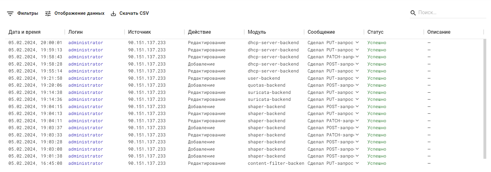

# Действия администраторов

Ideco NGFW логирует действия администраторов, которые вносят изменения в конфигурацию NGFW из веб-интерфейса, локального интерфейса и терминала.

При работе Ideco NGFW в режиме [кластера](settings/server-management/cluster.md) логи действия администраторов не передаются резервной ноде.


При бездействии в течение 15 минут администратор будет автоматически разавторизован.

