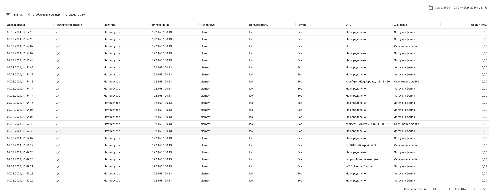

# Журнал антивируса


Для работы антивируса настройте расшифровку трафика на Ideco NGFW и включите антивирус, активировав опцию **Антивирусы веб-трафика** в разделе **Правила трафика -> Антивирусы веб-трафика**.

При отключенной опции **Антивирусы веб-трафика** данные в **Журнал антивируса** попадать не будут.


Раздел позволяет посмотреть логи работы антивируса.
При загрузке файла в сеть или скачивании на компьютер Ideco NGFW проверяет содержимое файла антивирусом.


Для фильтрации логов воспользуйтесь фильтром.
