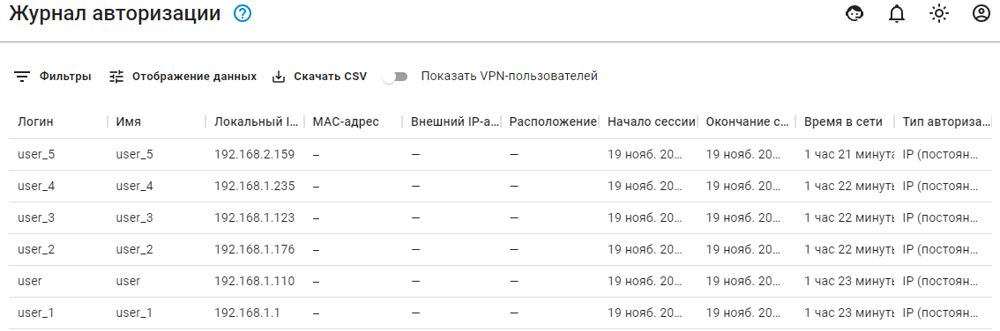

# Журнал авторизации

В разделе **Отчеты -&gt; Журнал авторизации** вам доступен список авторизованных на Ideco UTM пользователей в виде таблицы.

Вы можете воспользоваться возможностью поиска конкретных авторизованных пользователей с помощью фильтра. Для этого в верхней части экрана в поле **Столбец для фильтрации** выберите один из предлагаемых параметров \(логин, имя, IP-адрес, начало сессии, окончание сессии, тип авторизации\). В последнем поле введите значение, которое должен включать в себя выбранный вами столбец.

**При использовании фильтра имеется некоторая особенность:**

* Для открытой сессии каждые 5 минут происходит запись этой сессии в базу, и в поле «конец сессии» записывается текущее время. Соответственно, если первый запрос был отправлен до момента синхронизации буфера, то вернется одно время окончания. А если следующий запрос произойдет после момента синхронизации, то время окончания для открытой сессии изменится, и возвращается новое.
* Для завершённой сессии информация о времени закрытия не меняется.

