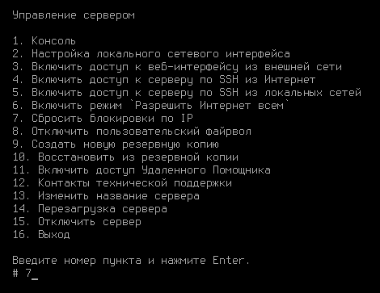

# Журнал событий


Время хранения логов в разделе **Журналы** 3 месяца. Далее просматривать логи можно в разделе **Управление сервером -> Терминал**.


В разделе можно просматривать логи работы следующих служб:

* VPN-авторизация пользователей (ideco-vpn-auth);
* Прокси-сервер (ideco-squid);
* Ядро операционной системы (kernel);
* Служба защиты от подбора паролей (fail2ban);
* DHCP-сервер (ideco-dnsmasq);
* Журнал службы интеграции с доменом (интеграция с Active Directory);
* IPsec (ideco-ipsec-backend);
* Контрольные суммы файлов.

Чтобы просмотреть логи конкретной службы, воспользуйтесь строкой поиска или фильтром.

## Защита от brute-force атак

 
Защита от brute-force атак работает только для UTM. 


После 6 неудачных попыток ввода пароля в течение 15 минут, IP-адрес подбирающего блокируется на 45 минут.

Модуль не настраивается в веб-интерфейсе.

Посмотреть логи работы службы можно в веб-интерфейсе во вкладке **Мониторинг -> Журналы**, задав фильтр `fail2ban` . Либо на вкладке **Терминал**, введя команду `journalctl -u fail2ban`.

Сбросить блокировки можно из локального меню шлюза: **Правила доступа -> Сбросить блокировки по IP**.

