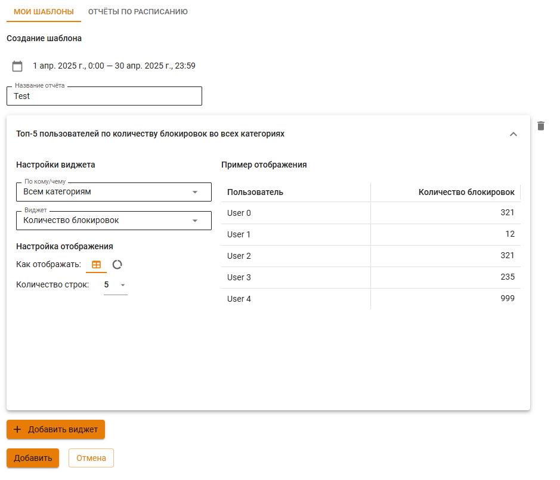
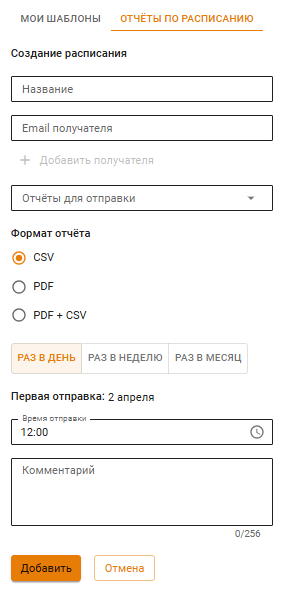
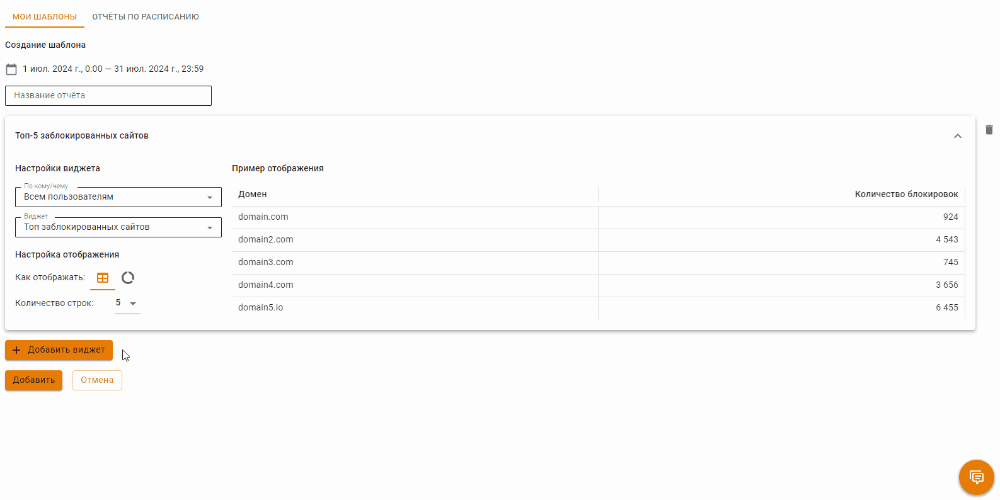

# Конструктор отчетов

UTM предоставляет возможность создать шаблоны отчетов и настроить их рассылку в формате .pdf на электронную почту.

## Мои шаблоны

На этой вкладке создаются шаблоны со статистикой, которую можно просмотреть в браузере, сохранить в формате .pdf или отправить на электронную почту.

При нажатии на кнопку **Добавить** откроется меню настройки шаблона. 

Задайте временной промежуток, название отчета и нажмите **Добавить виджет**. Один шаблон может содержать несколько виджетов.

Настройка виджетов:
* В строке **По кому/чему** выберите объект, по которому будет собираться статистика. Если вы выбираете **Определенный** объект (например *Определенный пользователь* или *Определенная группа*), то появится дополнительная строка **Объекты**, где можно выбрать несколько объектов;
* В строке **Виджет** укажите, какую информацию вы хотите видеть по выбранному объекту;
* Задайте **Настройки отображения**. 
  
После окончания настройки шаблона, нажмите **Создать**.

## Отчеты по расписанию

На этой вкладке предоставлена возможность создания/редактирования настроек для отправки рассылки на электронную почту.

Для создания настройки нажмите **Отчеты по расписанию -> Добавить** в левом верхнем углу. В одной настройке можно указать несколько e-mail-получателей (кнопка **Добавить получателя**) и несколько отчетов (кнопка **Добавить отчет**).

Отчеты будут отправляться:
* **Раз в день** - отправка произойдет на следующий день после сохранения, если время отправки меньше текущего на сервере;
* **Раз в неделю** - укажите день и время отправки;
* **Раз в месяц** - укажите определенный по счету день и время или каждое 1-е число месяца. Если выбрано 31-е число, но в месяце меньше дней, то выбирается последнее число месяца.

При нажатии на кнопку **Создать** UTM сохранит все пользовательские настройки времени отправки во всех фильтрах (раз в день, раз в неделю и раз в месяц), но отправляться шаблон будет только в период, выбранный пользователем. \
Например:  
1\. При создании отчета задается временной период:
* Раз в неделю;
* День недели - Четверг; 
* Нажимаем *Создать*. 

2\. Переходим к редактированию отчета по кнопке **Редактировать** и меняем настройки временного периода:
* Раз в месяц;
* Каждую вторую среду;
* Нажимаем *Сохранить*.

3\. Вновь переходим к редактированию отчета и выбираем **Раз в месяц**, откроются настройки, созданные в пункте 1.

#### Пример: Требуется настроить отправку отчета с информацией о заблокированных сайтах по всем пользователям каждое первое число месяца

Первое, что нужно сделать, это создать шаблон отчета, на основании которого будет собрана статистика для отправки:

1\. Нажмите **Добавить** во вкладке **Мои шаблоны**;

2\. Выберите временной период, за который следует сформировать отчет, из предложенных фильтров или укажите даты нажав **Выберите дату**;

3\. Укажите название отчета (строка *Название отчета*);

4\. Кликните по кнопке **Добавить виджет**;

5\. Заполните строки:
* **По кому/чему** - выберите **Всем пользователям**;
* **Виджет** - выберите **Топ заблокированных сайтов**;

6\. Укажите **Настройки отображения**

7\. Сохраните шаблон по кнопке **Создать**.

Создайте правило, по которому будет отправляться шаблон отчета на электронную почту:

1\. Нажмите **Добавить** во вкладке **Отчеты по расписанию**;

2\. Заполните строки:
* **Название** - любое название, которое поможет вам идентифицировать правило расписания;
* **Email получателя** - электронная почта получателя отчета. При необходимости отправки отчета нескольким получателям, укажите дополнительные адреса по кнопке **Добавить получателя**.

3\. Выберите в выпадающем списке в строке нужный шаблон;

4\. Укажите настройки даты/дня и времени отправки отчета получателю.