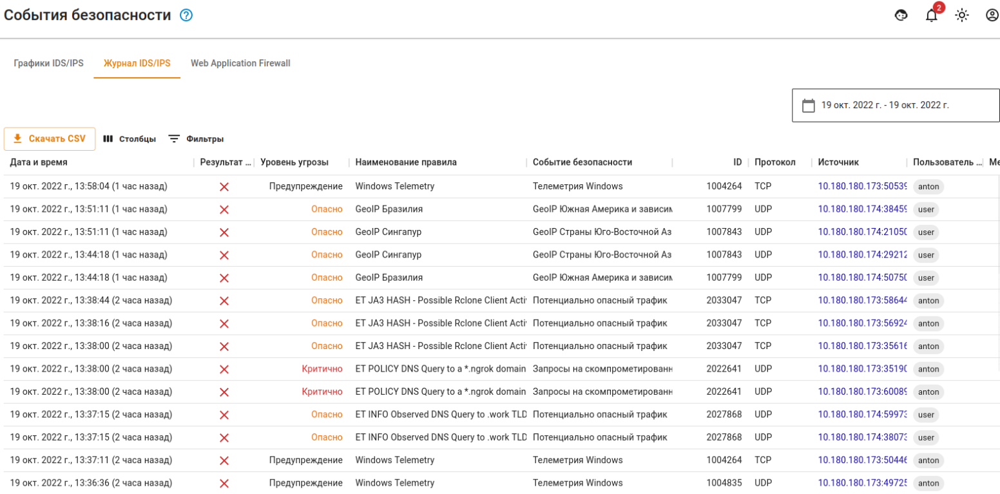
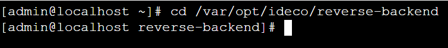

# События безопасности


Все виджеты формируются в часовом поясе сервера.


Раздел структурирует информацию, полученную от раздела [Предотвращение вторжений](../access-rules/ips/README.md).

## Выбор периода

Все отображаемые данные можно фильтровать по дате и времени. Например, установить какой-то временной период (по кнопке ) или воспользоваться одним из предустановленных фильтров:

Если ни один фильтр по дате и времени не задан, то по умолчанию устанавливается интервал **Сегодня** в часовом поясе сервера.

## Графики IDS/IPS

Виджеты содержат краткую информацию, собранную разделом **Предотвращение вторжений**. Подробная информация о всех срабатываниях правил **Предотвращение вторжений** доступна на вкладке **Журнал IDS/IPS** в виде таблицы.  

В таблице можно найти ID правила, которое сработало, и при необходимости создать исключение в разделе [Предотвращение вторжений](../access-rules/ips/README.md).

### График Количество атак по уровню угрозы

Информация представлена в виде графика с пятью значениями угрозы безопасности:
* **Критично** - уровень угрозы 1;
* **Важно** - уровень угрозы 2;
* **Предупреждение** - уровень угрозы 3;
* **Не классифицированно** - уровень угрозы 4;
* **Не распознано** - уровень угрозы 255.

Пример виджета *Количество атак по уровню угрозы*:

При нажатии на уровень угрозы, все виджеты и таблица фильтруют содержание для этого уровня. Для перехода обратно к списку уровней угроз, нажмите еще раз по выбранному уровню:

### Описание виджетов

Топ пользователей по заблокированным запросам

В топ попадают только те пользователи, которые были успешно авторизованы. Таким образом на диаграмму не попадут не авторизованные пользователи, запросы которых блокировались.

Топ атакованных адресов

В топ атакованных попадают как внешние, так и внутренние адреса. Один из примеров, когда атакованный адрес является внешним, - работа трояна изнутри защищаемой сети.

Топ атакующих адресов

Атакующим адресом может быть как внешний, так и внутренний. Например: внутренним атакующим адресом может считаться адрес, с которого зафиксирована работа трояна.

Топ заблокированных типов атак

Виджет подсчитывает статистику типов атак (например, типы атак *Чёрный список IP-адресов* или *Попытки получения привилегий администратора*, объединяющие в себе группу нескольких правил) по количеству срабатываний с данным типом атаки. \
Тип атаки указан в столбце *Событие безопасности* в таблице внизу раздела.

Топ атакующих стран

Топ атакующих стран строится по IP-адресам, полученным при срабатывании правил в разделе *Предотвращение вторжений*. Если IP-адрес не геокодируется в наименование страны, такой адрес не отображается в виджете. \
По этой причине локальные IP-адреса не отображаются в виджете.

## Журнал IDS/IPS

Содержит таблицу с информацией о всех срабатываниях правил из раздела Предотвращение вторжений. \
IP-адреса в столбцах **Источник** и **Назначение** кликабельны и при нажатии ведут на сервис [Whois](https://www.nic.ru/whois/?searchWord) для получения информации о регистрации домена.

## Web Application Firewall

Содержит информацию о срабатывании правил Web Application Firewall в виде таблицы:

IP-адреса в столбцах **Адрес источника** и **Адрес назначения** кликабельны и при нажатии ведут на сервис [Whois](https://www.nic.ru/whois/?searchWord) для получения информации о регистрации домена.