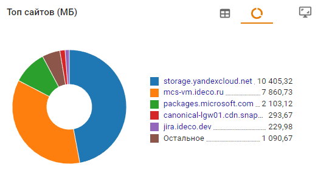
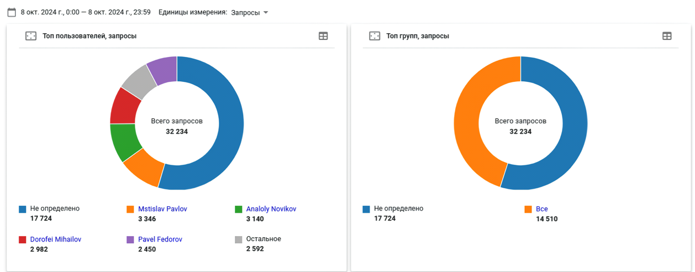
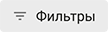

# Трафик
 
Раздел автоматически собирает статистику из [Контент-фильтра](../access-rules/content-filter/README.md) (категории и сайты) и [Контроля приложений](../access-rules/application-control.md) (протоколы), собирая ее в виджеты с по умолчанию заданными фильтрами.

Вы можете выбрать способ отображения информации:
* Круговая диаграмма () и таблица () - содержит топ 5 объектов. Каждый объект кликабелен и ведет на страницу с виджетами, в которых статистика фильтруется по этому объекту. 
  

 Единицу измерения можно изменить в левом верхнем углу:
 **Гифка**

* Развернутый режим () - данные по всем объектам из топа. Для поиска по объектам воспользуйтесь **Фильтром**(). 
 

 Если в правом верхнем углу установлен флаг в строке **Запросы**, то отфильтруется по убыванию в колонке **Запросы**. Если **Трафик**, то по убыванию в колонке **Входящий**:

 **Гифка**

 Для сохранения полученного результата в .pdf нажмите **Экспорт** ().

**Пример использования:** \
**А)** На какие запрещенные сайты переходил определенный пользователь: 
* Откройте в раздел **Отчетность -> Трафик**;
* В виджете **Топ пользователей** найдите нужного пользователя и кликните по нему. 
  
  Если пользователя нет в списке, то нажмите **Развернуть** () в правом верхнем углу виджета (откроется список всех пользователей);
* В виджете **Топ заблокированных сайтов** UTM покажет топ 5 блокировок. Для просмотра полного списка блокировок нажмите **Развернуть** ().
  
**Б)** Каким пользователям заблокировали определенное приложение: 
* Откройте в раздел **Отчетность -> Трафик**;
* В виджете **Топ заблокированных протоколов** найдите требуемый протокол и кликните по нему. Если его нет в списке, то нажмите **Развернуть** ();
* 

Подробнее создании собственных фильтров в статье [Конструктор отчетов](report-designer.md).