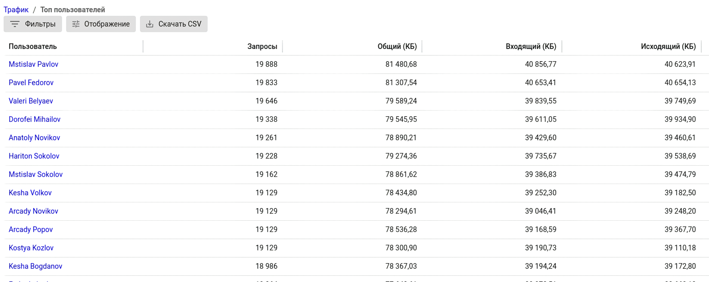

# Трафик
 
**************Какую информацию и из каких разделов содержит**************

******************Как структурируется******************

********************Какая есть фильтрация и навигация********************

 Вы можете выбрать способ отображения информации:
 * Круговая диаграмма () - 
    
 * Таблица () - 
    
 * Развернутый режим () - 
    

***********Как найти какую то информацию на примере какого то кейса************

Например, при