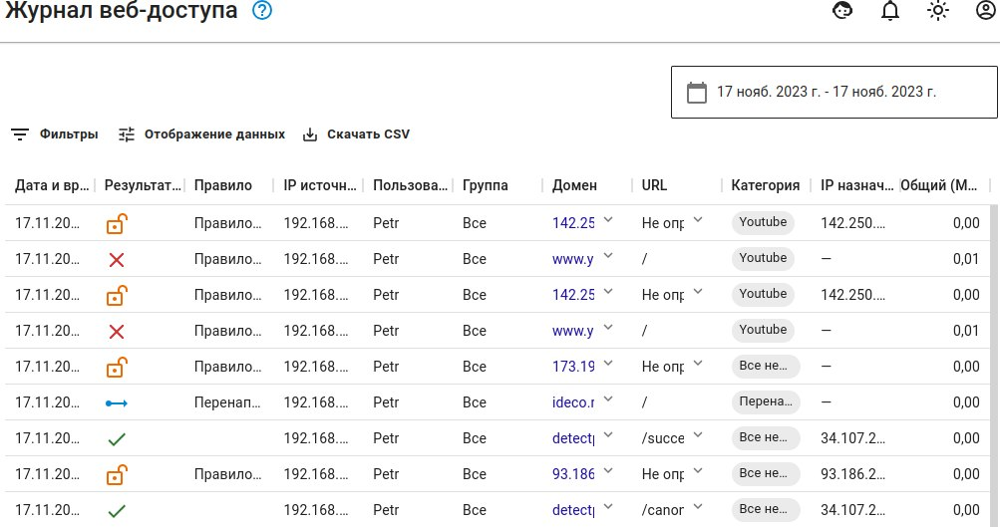

# Журнал веб-доступа

Раздел позволяет посмотреть результат обработки пользовательского запроса службой **Контент-фильтра**. Для просмотра **Журнала веб-доступа** перейдите в раздел **Отчеты и Журналы -> Журнал веб-доступа**.

Результаты обработки службы:
*  - **Разрешено**
*  - **Расшифровано**
*  - **Запрещено**
*  - **Перенаправлено на**


Если нет доступа к какому-либо интернет-ресурсу, воспользуйтесь разделом **Журнал веб-доступа** для поиска правила, блокирующего этот ресурс.



Для просмотра блокировок по конкретному правилу воспользуйтесь фильтром, указав в форме наименование правила и оператор.

