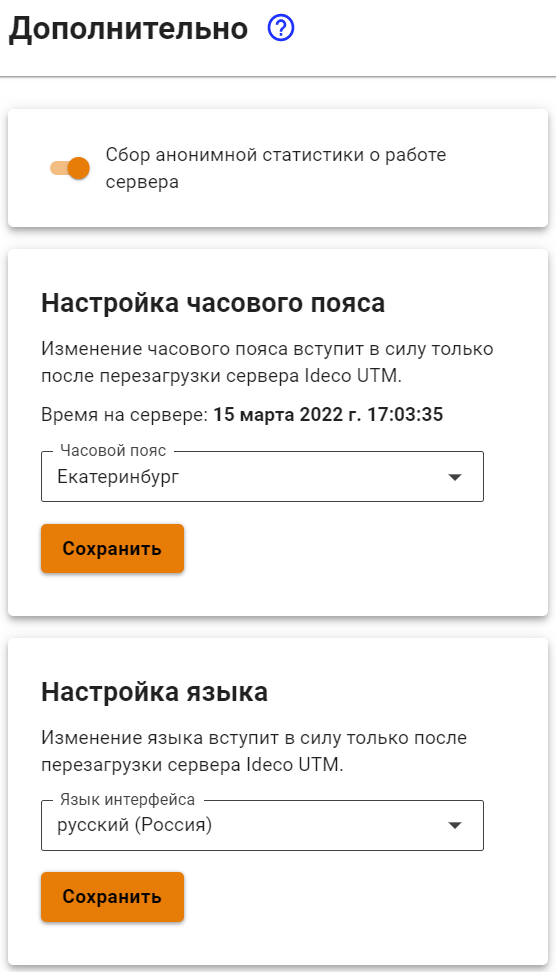

# Дополнительно

Настройка осуществляется через веб-интерфейс в разделе **Управление сервером -> Дополнительно**.

* **Настройка часового пояса** - установите часовой пояс для корректного сбора логов и статистики.
* **Сбор анонимной статистики о работе сервера** - включение данного параметра разрешает серверу отправлять информацию об используемых модулях. При этом не отправляется информация о пользователях, трафике проходящем через сервер, сетевых интерфейсах и идентификаторах сервера и лицензии.


Изменение часового пояса вступит в силу только после перезагрузки сервера Ideco UTM.

