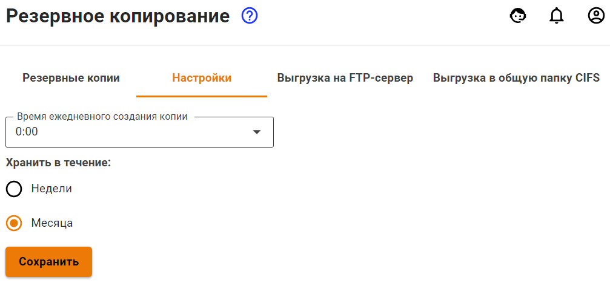


Название службы раздела **Бекапы**: `ideco-backup-backend`; `ideco-backup-create`; `ideco-backup-restore`; `ideco-backup-rotate`.\
Список служб для других разделов доступен по [ссылке](terminal.md).



Восстановить бекап настроек в Ideco UTM 9 из Ideco UTM 7 можно только с версии 7.9.9 Build 176.


Интернет-шлюз поддерживает следующие типы автоматического резервного копирования:

* на сетевое файловое хранилище по протоколу FTP;
* на сетевое файловое хранилище по протоколу NetBIOS;
* на локальный жесткий диск.

Для настройки автоматического резервного копирования перейдите в раздел\
**Управление сервером -> Бекапы -> Настройки**. Бекап создается каждый день в указанный в настройках час (рекомендуется выбирать ночное время для создания резервной копии).

Хранить бекапы можно в течение недели или месяца.

## Бекапы на удаленное файловое хранилище по протоколу FTP

Ключевые параметры, необходимые для настройки резервного копирования на FTP-сервер, описаны в таблице ниже.

<table><thead><tr><th width="188">Параметр</th><th>Описание</th></tr></thead><tbody><tr><td>Адрес сервера</td><td>IP-адрес удаленного FTP-сервера, на котором будут размещаться копии базы данных</td></tr><tr><td>Логин</td><td>Имя пользователя для авторизации на FTP-сервере</td></tr><tr><td>Пароль</td><td>Пароль для авторизации на FTP-сервере</td></tr><tr><td>Путь к каталогу</td><td>Каталог, в который будут записываться копии базы данных</td></tr></tbody></table>

## Бекапы на сетевое файловое хранилище по протоколу NetBIOS (CIFS)

Ключевые параметры, необходимые для настройки резервного копирования на NetBIOS-сервер, описаны в таблице.

<table><thead><tr><th width="189">Параметр</th><th>Описание</th></tr></thead><tbody><tr><td>Адрес сервера</td><td>IP-адрес удаленного NetBIOS-сервера, на котором будут размещаться копии базы данных</td></tr><tr><td>Логин</td><td>Имя пользователя для авторизации на сетевом ресурсе Windows</td></tr><tr><td>Пароль</td><td>Пароль для авторизации на сетевом ресурсе Windows</td></tr><tr><td>Путь к каталогу</td><td>Каталог, в который будут записываться копии базы данных</td></tr></tbody></table>


Для доменной учетной записи формат поля **Логин** должен иметь вид: **Имя\_пользователя**.

Укажите путь к каталогу в UNIX-формате. К примеру, в ОС Windows каталог открывается по следующему пути `\\192.168.1.1\dir_1\dir_2\backup`, значит, в поле **Путь к каталогу** пропишите `dir_1/dir_2/backup`.


## Бекапы на локальный жесткий диск

Загрузите бекап с сервера или с компьютера на сервер с помощью веб-интерфейса либо локального меню.

* Кнопка **Добавить** позволяет создать бекап настроек сервера. Копии настроек создаются автоматически ежедневно;
* Кнопка **Мгновенное восстановление** позволяет восстановить все настройки, кроме использованного трафика по квотам, изменений в списке пользователей и отчетах. Бекап применится без перезагрузки.
* Кнопка **Полное восстановление** позволяет восстановить бекап настроек. Возможно восстановление настроек только для бекапа версии, одинаковой с установленной на сервере. Система будет перезагружена;
* Кнопка **Скачать** позволяет скачать бекап с сервера на ваш компьютер;
* Кнопка **Удалить** удаляет бекап с сервера.

  Интерфейс управления бекапами представлен на скриншоте ниже.

  

### Управление бекапами через локальное меню

Чтобы создать новый бекап через локальное меню Ideco NGFW, выполните действия: 

1\. Выберите пункт **9** и нажмите **Enter**. 

2\. Ведите комментарий для резервной копии и нажмите **Enter**.

Пример создания резервной копии через локальное меню приведен на скриншоте ниже:

Чтобы восстановить конфигурацию из резервной копии, выполните действия:

1\. Выберите пункт **10** и нажмите **Enter**. 

2\. Выберите из списка резервную копию (если копий несколько), введя пункт нужной копии, и нажмите **Enter**. 

3\. Для восстановления из резервной копии необходимо перезагрузить сервер. Введите **y**, а затем **Enter** для перезагрузки.

Пример восстановления из резервной копии через локальное меню приведен на скриншоте ниже:

