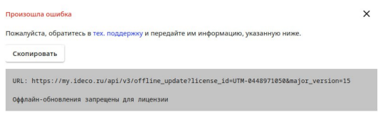
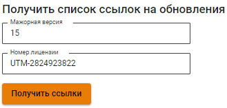

# Управление лицензиями

_(заголовок по Veeam должен включать отглагольное существительное или глагол. Например, Установка лицензии/Управление лицензиями или Как активировать лицензию)_

Лицензия предоставляет право на законное использование продукта. В Ideco NGFW VPP доступны [лицензии](/general/license.md):
* **Enterprise** - коммерческая лицензия с правом на использование в течение 5 лет;
* **Enterprise-demo** - бесплатная лицензия с правом на использование в течение 40 дней;
* **SMB** - бесплатная лицензия с ограниченным набором функций, право на использование предоставляется на 5 лет.

Перед активацией лицензии необходимо:
* Зарегистрироваться на [MY.IDECO.RU](/initial-setup/my-ideco.md) для получения доступа в личный кабинет;
* Скачать из личного кабинета образ для установки Ideco NGFW VPP;
* Установить Ideco NGFW VPP;
* Настроить доступ в интернет.

Для активации добавьте в личный кабинет MY.IDECO.RU лицензию и привяжите к нужному серверу.

## Добавление лицензии

Авторизуйтесь в личном кабинете MY.IDECO.RU.

### Enterprise-лицензия

После покупки лицензии выдается токен формата `owhYLGvT6Xmt819JyinSxREkJfvjVO63`.

В личном кабинете MY.IDECO.RU перейдите в раздел **NGFW -> Лицензирование** и нажмите **Добавить коммерческую лицензию**. Скопируйте токен в поле **Токен лицензии** и нажмите **Добавить**:

Токен станет недействителен, а купленная лицензия отобразится в таблице **Свободные лицензии**.

### SMB-лицензия

В личном кабинете MY.IDECO.RU перейдите в раздел **Лицензирование** и нажмите **Добавить бесплатную лицензию**. 

Добавленная лицензия отобразится в таблице **Свободные лицензии**.

## Привязка лицензии к серверу

В Ideco NGFW VPP лицензию можно привязать онлайн и офлайн.

### Онлайн-привязка

Доступны два способа онлайн-привязки:

1\. В личном кабинете MY.IDECO.RU на вкладке **Лицензирование** выберите сервер и нажмите на . В открывшемся окне выберите нужную лицензию и сохраните изменения, нажав **Привязать лицензию**.

2\. В личном кабинете MY.IDECO.RU на вкладке **Лицензирование** выберите **Свободные лицензии** и нажмите на . Укажите нужный сервер и нажмите **Привязать**.


Назначьте имеющиеся коммерческие лицензии на любой зарегистрированный сервер Ideco NGFW с учетом следующих ограничений:

* Одна лицензия может быть привязана только к одному серверу;
* Демо-лицензию нельзя привязать к другому серверу;
* Демо-лицензию нельзя повторно получить на одну и ту же инсталляцию сервера;
* При удалении сервера с демо-лицензией, лицензия будет так же удалена.


### Офлайн-привязка

1\. Для предоставления офлайн-лицензии обратитесь к менеджеру.

2\. Привяжите предоставленную лицензию к серверу одним из способов онлайн-привязки.

Если была выбрана лицензия, не подходящая для офлайн-регистрации сервера, появится ошибка:

Пример наименования сервера для **офлайн**-регистрации: `UTM (UTM Unknown)`

3\. Перейдите в раздел **NGFW -> Офлайн** и введите в соответствующие поля мажорный номер версии и номер лицензии:

4\. Нажмите **Получить ссылки** и сохраните файл конфигураций, нажав на license:

Помимо информации о лицензии личный кабинет предоставит файлы для обновления баз модулей безопасности. Подробнее о процессе обновления - в статье [Регистрация сервера](../../initial-setup/server-registration.md#obnovlenie-baz-modulei-bezopasnosti).

5\. Добавьте конфигурационный файл c информацией о лицензии в Ideco NGFW:

* Перейдите в раздел **Управление сервером -> Терминал**;
* Загрузите полученный файл `license.json` на сервер Ideco NGFW VPP в директорию `/var/cache/ideco/license-backend/`;
* Перезапустите сервис лицензий командой `systemctl restart ideco-license-backend.service`;
* Перейдите в раздел **Управление сервером -> Лицензия** и убедитесь, что лицензия установлена.

## Просмотр информации о лицензиях

Просмотр информации о сервере и лицензии доступен на вкладке **Лицензирование** при нажатии на  в колонке **Лицензия**.

Информация о лицензии содержит сведения о сроке действия лицензии, количестве пользователей, сроке окончания обновлений, технической поддержки продукта и др.:

