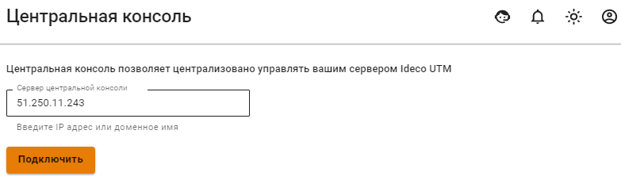
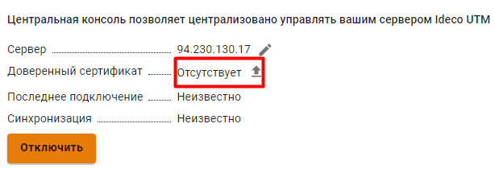
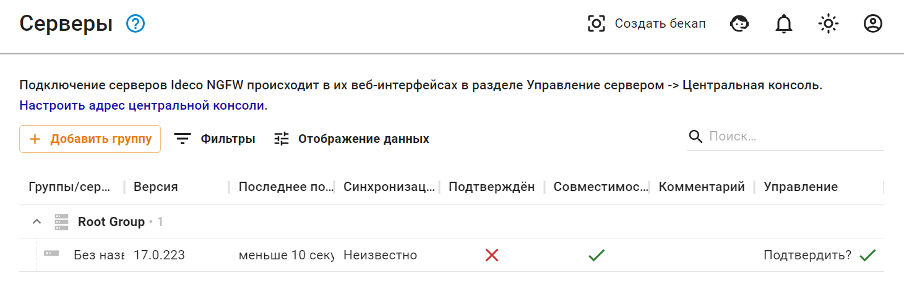
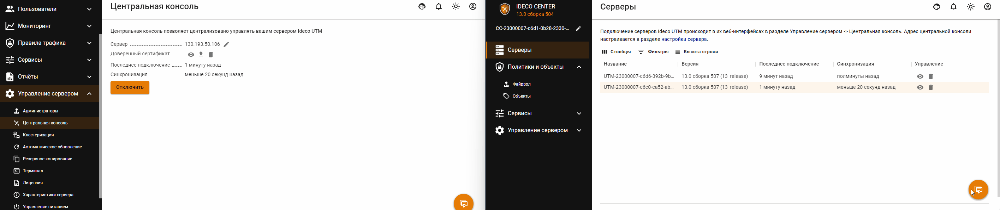
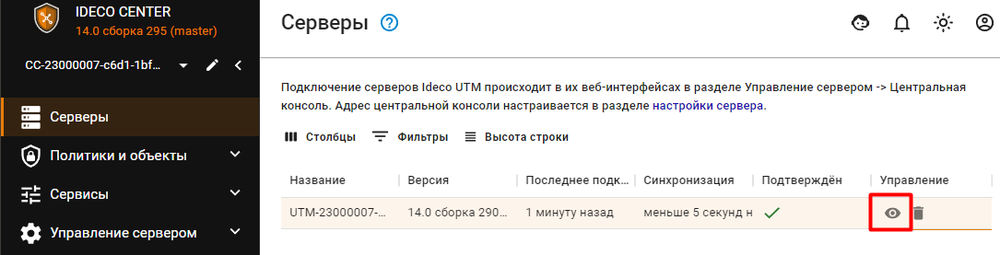
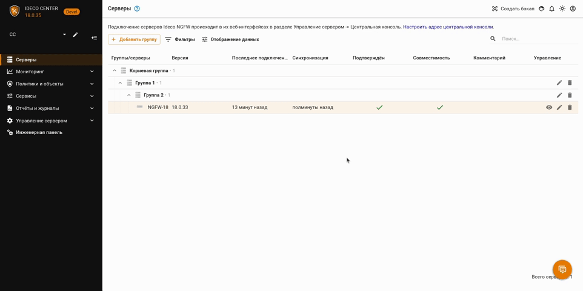

# Центральная консоль


Имя службы раздела **Центральная консоль**: `ideco-central-console-backend.service`. \
Список служб для других разделов, доступен по [ссылке](../terminal.md).


Ideco Center - это центральная консоль, которая поможет в администрировании сразу нескольких серверов Ideco UTM. 

**Возможности Ideco Center:**

* [x] Создание правил политик безопасности (файрвол, контент-фильтр и др.) и объектов, которые переносятся в подключенные сервера Ideco UTM одновременно;
* [x] Переход из Ideco Center в веб-интерфейс подключенных Ideco UTM;
* [x] Управление правами доступа администраторов.

Подробнее о работе политик безопасности и объектов в статье [Политики и объекты](policies-and-objects.md).

Файл для установки центральной консоли доступен для скачивания в [личном кабинете](https://my.ideco.ru/#/utm/download). Процесс установки Ideco Center аналогичен [процессу установки Ideco UTM](../../../installation/installation-process.md).

## Подключение Ideco UTM к Ideco Center


Если в подключаемом Ideco UTM используется кластер, достаточно подключить только активную ноду, пассивная автоматически примет эту настройку. 

Сетевое подключение производится в направлении от Ideco UTM к Ideco Center, т.е. возможна связь и когда Ideco UTM за NAT. 


Для подключения Ideco UTM к Ideco Center:
* Перейдите в раздел **Управление сервером -> Центральная консоль**;
* Введите IP-адрес или доменное имя в строке **Сервер центральной консоли** и нажмите **Подключить**:

  

  Если вместо доменного имени указан IP-адрес Ideco Center, загрузите корневой сертификат Ideco Center в Ideco UTM:

  
  
  Скачать корневой сертификат можно в Ideco Center, раздел **Сервисы -> Сертификаты**.

* В интерфейсе Ideco Center перейдите в раздел **Серверы** и подтвердите подключение кнопкой .

  


Если сервер Ideco Center находится за NAT, укажите IP-адрес или доменное имя в разделе **Управление сервером -> Дополнительно -> Адрес центральной консоли**.


Удаление сервера Ideco UTM из Ideco Center разорвет привязку в интерфейсе Ideco UTM:

## Переход из веб-интерфейса Ideco Center в веб-интерфейс Ideco UTM

В Ideco Center предусмотрено два способа перехода в Ideco UTM:

1\. Перейдите в раздел **Серверы** нажмите на :

В новой вкладке откроется веб-интерфейс Ideco UTM.

2\. Нажмите на   в левом верхнем углу и выберите нужный UTM:


Администратор Ideco Center с ролью **Только просмотр** не сможет производить никаких настроек в веб-интерфейсе подключенного Ideco UTM — при попытке внесения изменений будет появляться окно с ошибкой **Доступ запрещен**.

