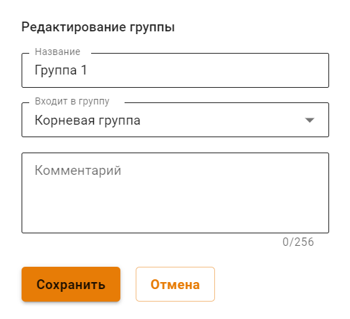
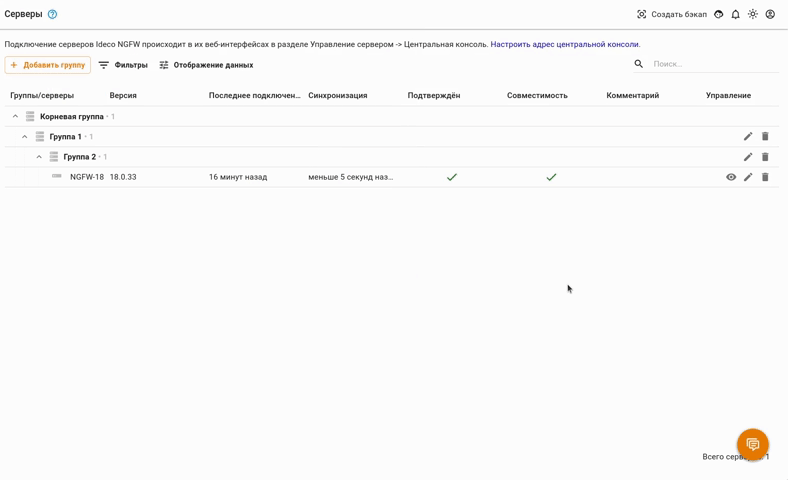
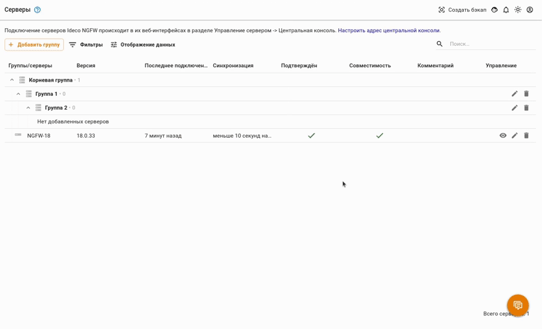

# Центральная консоль


Название службы раздела **Центральная консоль**: `ideco-central-console-backend`. \
Список служб для других разделов доступен по [ссылке](../terminal.md).

Нужна помощь при настройке Ideco NGFW? Получите быстрый ответ от [чат-бота](https://gpt-docs.ideco.ru/) нашей документации!


Ideco Center - это центральная консоль, которая поможет в администрировании нескольких серверов Ideco NGFW. На данный момент не требует лицензирования и не имеет ограничений к использованию. Автоматически распространяет политики безопасности по всем подключенным Ideco NGFW, даже если они были подключены после того, как политики были настроены.

**Возможности Ideco Center:**

* [x] Централизованное управление серверами, подключенными к Ideco Center, с возможностью группировки Ideco NGFW и формирования иерархии из этих групп для совместного управления;
* [x] Создание правил политик безопасности и объектов, которые одновременно переносятся в серверы Ideco NGFW определенной группы. В частности - создание пользовательских категорий контент-фильтра; 
* [x] Переход из Ideco Center в веб-интерфейс подключенных Ideco NGFW. Администраторы Ideco Center имеют доступ к подключенными NGFW, но администраторы подключенных NGFW не имеют доступ к Ideco Center.
* [x] Обновление подключенных к Ideco Center NGFW;
* [x] Управление правами доступа администраторов серверов NGFW. 


Подробнее о работе политик безопасности и объектов - в статье [Политики и объекты](policies-and-objects.md).


**Технические требования для серверов и виртуальных машин:**

<table><thead><tr><th width="100">Комплектующие</th><th>Минимальные системные требования</th></tr></thead><tbody><tr><td>Процессор</td><td>Intel i3/i5/i7/i9/Xeon с поддержкой SSE 4.2</td></tr><tr><td>Объем оперативной памяти</td><td>16 ГБ (16-64 ГБ в зависимости от количества пользователей)</td></tr><tr><td>Дисковая подсистема</td><td>SSD объемом 150 Гб или больше, с интерфейсом SATA, mSATA, SAS, NVMe.</td></tr><tr><td>Сеть</td><td>Одна сетевая карта. Рекомендуется использовать карты на чипах Intel. Поддерживаются Realtek, D-Link и другие.</td></tr><tr><td>Гипервизоры</td><td>VMware, Microsoft Hyper-V (2-го поколения), VirtualBox, KVM, Citrix XenServer.</td></tr><tr><td>Дополнительно</td><td>Монитор и клавиатура</td></tr><tr><td>Замечания</td><td>Обязательна поддержка UEFI. Не поддерживаются программные RAID-контроллеры (интегрированные в чипсет). Для виртуальных машин необходимо использовать фиксированный, а не динамический размер хранилища и оперативной памяти.</td></tr></tbody></table>

Файл для установки центральной консоли доступен для скачивания в [личном кабинете](https://my.ideco.ru/#/utm/download). Процесс установки Ideco Center аналогичен [процессу установки Ideco NGFW](../../../installation/installation-process.md).

## Подключение Ideco NGFW к Ideco Center


Если в подключаемом Ideco NGFW используется кластер, достаточно подключить только активную ноду, пассивная автоматически примет эту настройку. 

Сетевое подключение производится в направлении от Ideco NGFW к Ideco Center, т. е. возможна связь и когда Ideco NGFW за NAT. 


Для подключения Ideco NGFW к Ideco Center:
* Перейдите в раздел **Управление сервером -> Центральная консоль**;
* Введите IP-адрес или доменное имя в строке **Сервер центральной консоли** и нажмите **Подключить**:

  

  Если вместо доменного имени указан IP-адрес Ideco Center, загрузите корневой сертификат Ideco Center в Ideco NGFW:

  
  
  Скачать корневой сертификат можно в Ideco Center, раздел **Сервисы -> Сертификаты**.

* В интерфейсе Ideco Center перейдите в раздел **Серверы** и подтвердите подключение кнопкой .

  


Если сервер Ideco Center находится за NAT, укажите IP-адрес NAT-устройства или доменное имя в разделе **Управление сервером -> Дополнительно -> Адрес центральной консоли**.


Удаление сервера Ideco NGFW из Ideco Center разорвет привязку в интерфейсе Ideco NGFW:

## Группировка серверов Ideco NGFW

В Центральной консоли можно группировать синхронизированные с ней серверы NGFW и формировать из них древовидную структуру. Это позволит управлять сразу несколькими серверами, применять правила и политики безопасности ко всем серверам определенной группы.

Структура групп серверов в Ideco Center предполагает три уровня вложенности. Первый - корневая группа Root Group. В нее по умолчанию попадают все серверы NGFW, впервые синхронизированные с Ideco Center, а также все группы, созданные администратором.

При этом на Ideco NGFW будут распространяться правила и политики безопасности всех вышестоящих групп в соответствии с вложенностью. 


Подключенные к Ideco Center серверы NGFW и созданные в ЦК группы оп умолчанию входят в группу Root Group, вынести их оттуда нельзя.


### Создание, редактирование и удаление групп серверов

Чтобы создать группу серверов в Ideco Center, выполните действия:

1\. Перейдите в раздел **Серверы** и нажмите **Добавить группу**.

2\. В открывшемся окне заполните **Название группы** и выберите родительскую группу из раскрывающегося списка (если это первая создаваемая группа, в нем будет только Root Group):

3\. Нажмите **Сохранить**.

Чтобы отредактировать группу, выполните действия:

1\. Нажмите на  напротив ее названия. 

2\. В открывшемся окне можно изменить название и родительскую группу:

Чтобы удалить группу серверов, нажмите на . Если в удаленной группе были серверы, то они переместятся в Root Group:


Удалить или отредактировать Root Group нельзя. 


### Перемещение серверов Ideco NGFW между группами

Чтобы переместить синхронизированный с ЦК сервер Ideco NGFW из одной группы в другую, выполните действия:

1\. Нажмите на  напротив ее названия.

2\. В открывшемся окне из раскрывающегося списка выберите группу, в которую хотите переместить сервер:

## Переход из веб-интерфейса Ideco Center в веб-интерфейс Ideco NGFW

В Ideco Center предусмотрено два способа перехода в Ideco NGFW:

1\. Перейдите в раздел **Серверы** и нажмите на :

В новой вкладке откроется веб-интерфейс Ideco NGFW.

2\. Нажмите на   в левом верхнем углу и выберите нужный NGFW:


Для обновления серверов, подключенных к центральной консоли, перейдите в интерфейс NGFW одним из указанных выше способов и воспользуйтесь статьей [Автоматическое обновление сервера](settings\server-management\server-update.md). 
