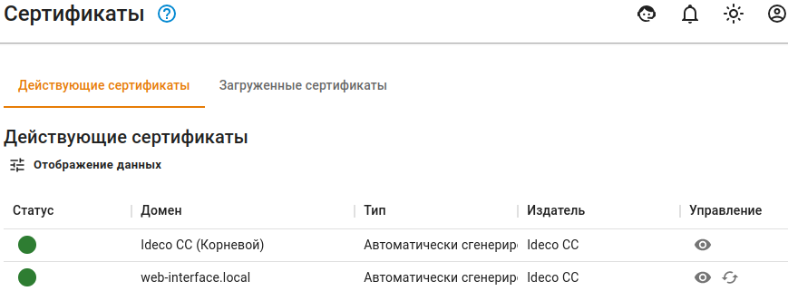
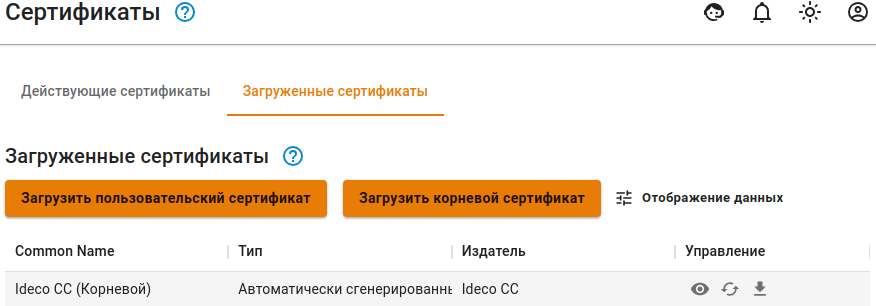

# Сертификаты

В этом разделе отображаются SSL сертификаты или цепочки сертификатов.

### Действующие сертификаты

В таблице _Действующие сертификаты_ отображаются:
* Автоматически сгенерированные цепочки сертификатов 
* Загруженные цепочки сертификатов, используемые модулями Ideco Center.


Если в таблице _Действующие сертификаты_ одна и та же цепочка сертификатов указана в нескольких строках, то она используется несколькими модулями.

Перевыпуск сертификата происходит автоматически при:
* Окончании срока действия сертификата;
* Перевыпуске или замене корневого сертификата.


Процесс выпуска сертификата

1. Создается локальная цепочка сертификатов, подписанная корневым (самоподписанным) сертификатом;
2. Параллельно с созданием локальной цепочки сертификатов, отправляется запрос на выпуск цепочки в Let’s Encrypt;
3. При успешном выпуске цепочки сертификатов Let’s Encrypt будет заменена локальная цепочка;
4. Если выпуск цепочки сертификатов Let’s Encrypt завершился неудачей, то локальная цепочка сертификатов продолжит использоваться.

Процесс перевыпуска сертификата

При перевыпуске не корневой цепочки сертификатов, Center попробует актуализировать цепочку следующим образом:

* Проверяет загруженные сертификаты. Если сертификат найден, то заменит предыдущую цепочку на найденную;
* Если загруженных сертификатов нет, то Ideco Center обратится к Let’s Encrypt для выпуска новой цепочки сертификатов;
* Если цепочка от Let’s Encrypt получена, то она отобразится в таблице;
* Если получить цепочку сертификатов от Let’s Encrypt не удалось, то создается локальная цепочка сертификатов, подписанная корневым сертификатом.

При перевыпуске корневого сертификата Center заменит предыдущий сертификат на автоматически сгенерированный корневой сертификат.

### Загруженные сертификаты

В таблице _Загруженные сертификаты_ отображаются:
* Все загруженные цепочки сертификатов;
* Корневой сертификат Ideco Center.


Подробная инструкция по загрузке SSL-сертификата в [статье](upload-ssl-certificate-to-server.md).\
Для просмотра основной информации о сертификате нажмите кнопку .


### Требования к загружаемым сертификатам:

* Пользовательские или корневые сертификаты должны иметь расширения *.pem*;
* У корневого сертификата должно быть разрешение выдавать дочерние сертификаты *X509v3 Basic Constraints: CA: TRUE*;
* В составе сертификата *Издатель* и *Субъект* должны содержать поле *CN*.
## Особенности


Если требуется повторить попытку получения сертификата Let’s Encrypt, вместо самоподписанного, то нужно нажать на кнопку **Перевыпустить** в столбце **Управление**.

Если вы хотите заменить автоматически выпущенную цепочку сертификатов на свою, то при загрузке собственной цепочки сертификатов, **CN(Общее имя)** последнего сертификата в цепочке должно соответствовать домену для которого сертификат загружается.

Сертификат Let’s Encrypt **выпускается на 3 месяца** и будет **автоматически перевыпущен** по окончании срока действия.

Из этого раздела можно скачать корневой (самоподписанный) сертификат, нажав на соответствующую ссылку.



Подробнее о загрузке SSL-сертификата на сервер в [статье](upload-ssl-certificate-to-server.md).

