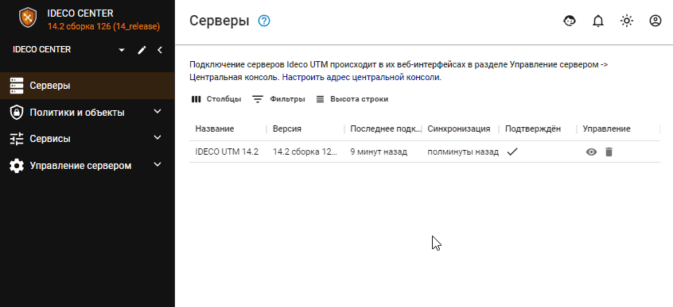

# Управление сервером

В центральной консоли (далее Ideco Center) разделы [Автоматическое обновление](server-update.md), [Резервное копирование](backup.md) и [Терминал](terminal.md) аналогичны этим разделам в Ideco NGFW. 

## Администраторы

В Ideco Center можно создать несколько администраторов с разными ролями: 
* *Администратор* - администратор с этой ролью имеет доступ ко всем функциональностям Ideco Center ([подробнее о возможностях](README.md));
* *Только просмотр* - администратор с этой ролью не имеет возможности управлять правилами в Ideco Center (создавать, менять приоритет и др.). Но может переходить в подключенные Ideco NGFW и управлять ими.


Удалять подключенный Ideco NGFW из Ideco Center могут все администраторы (и с ролью *Администратор*, и с *Только просмотр*).

 
Есть два способа подключения к веб-интерфейсу Ideco NGFW из Ideco Center, которые находятся в Ideco Center:
* Из раздела [Серверы](central-console.md) (по нажатию на  );
* При нажатии на стрелку в левом верхнем углу, выбрав нужный NGFW:
    
    
 
Войти в подключенный Ideco NGFW с логином и паролем администратора Ideco Center не возможно.
  

## Дополнительно

В разделе доступны настройки:

* **Адрес центральной консоли** - поле заполняется, если сервер Ideco Center находится за NAT;
* **Настройка часового пояса** - изменения вступают в силу только после перезагрузки Ideco Center;
* **Настройки языка** - изменения вступают в силу только после перезагрузки Ideco Center.
* **Сбор анонимной статистики о работе сервера** - включение данного параметра разрешает серверу отправлять информацию об используемых модулях. При этом не отправляется информация о пользователях, трафике проходящем через сервер, сетевых интерфейсах и идентификаторах сервера и лицензии.