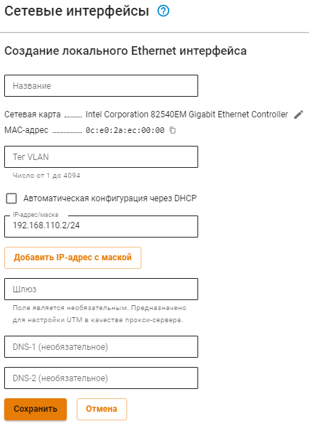

# Сервисы

## Сетевые интерфейсы

В отличие от Ideco UTM, в Ideco Center создается только локальный Ethernet интерфейс. Для этого нажмите **Добавить**, выберите сетевую карту и заполните нужные поля:

* **Название интерфейса** - Имя для идентификации интерфейса;
* **Сетевая карта** - Сетевой адаптер, который будет использоваться для подключения к интернет-провайдеру;
* **Тег VLAN**- VLAN ID. Такой сетевой интерфейс считается VLAN-интерфейсом. Заполняется в том случае если сетевая карта уже используется;
* **Автоматическая настройка через DHCP** - Используйте, если интернет-провайдер поддерживает автоматическую настройку Ethernet-интерфейса с помощью протокола DHCP;
* **IP-адрес/маска** - Назначьте на интерфейс несколько IP-адресов, если это требуется. Требуется указать один IP-адрес как минимум;
* **Шлюз** - IP-адрес шлюза;
* **DNS** - Доступно два поля для указания DNS сервера (необязательно).

## Маршрутизация

Маршрутизация работает аналогично маршрутизации Ideco UTM. Подробное описание по [ссылке](../services/routing.md).

## DNS

Принцип работы DNS в Ideco Center, аналогичный принципу работы [Внешних DNS-серверов](../../services/dns/README.md) в УТМ. Если вышестоящий роутер перехватывает DNS-запросы Ideco Center, то добавьте внешние DNS-сервера.
