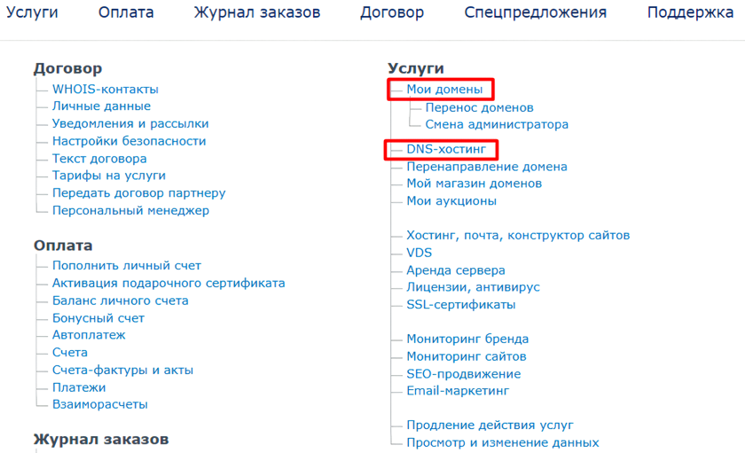
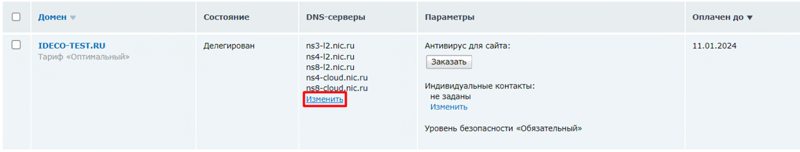
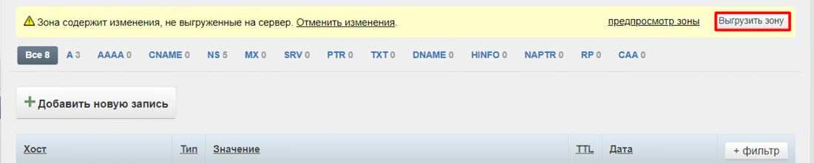

# Сервисы

## Сетевые интерфейсы

В отличие от Ideco NGFW, в Ideco Center создается только локальный Ethernet интерфейс. Для этого нажмите **Добавить**, выберите сетевую карту и заполните нужные поля:

* **Название интерфейса** - Имя для идентификации интерфейса;
* **Сетевая карта** - Сетевой адаптер, который будет использоваться для подключения к интернет-провайдеру;
* **Тег VLAN**- VLAN ID. Такой сетевой интерфейс считается VLAN-интерфейсом. Заполняется в том случае если сетевая карта уже используется;
* **Автоматическая настройка через DHCP** - Используйте, если интернет-провайдер поддерживает автоматическую настройку Ethernet-интерфейса с помощью протокола DHCP;
* **IP-адрес/маска** - Назначьте на интерфейс несколько IP-адресов, если это требуется. Требуется указать один IP-адрес как минимум;
* **Шлюз** - IP-адрес шлюза;
* **DNS** - Доступно два поля для указания DNS сервера (необязательно).

## Маршрутизация

Маршрутизация работает аналогично маршрутизации Ideco NGFW. Подробное описание по [ссылке](../../services/routing.md).

## DNS

Принцип работы DNS в Ideco Center, аналогичный принципу работы [Внешних DNS-серверов](../../services/dns/README.md) в Ideco NGFW. Если вышестоящий роутер перехватывает DNS-запросы Ideco Center, то добавьте внешние DNS-сервера.

## DDNS

DDNS в Ideco NGFW реализован через интеграцию с хостингом RU-CENTER. Поэтому перед настройкой DDNS, зарегистрируйтесь на сайте [RU-CENTER](https://www.nic.ru/) и приобретите [DNS-хостинг](https://www.nic.ru/catalog/for-domain-use/dns-hosting/). \
Для решения вопросов по работе с хостингом, воспользуйтесь страницей [помощи](https://www.nic.ru/help/).

### Настройка DDNS

1\. После входа в личный кабинет [RU-CENTER](https://www.nic.ru/) откроется страница [Для клиентов](https://www.nic.ru/manager/manager.cgi/). Для дальнейшей работы откройте два раздела - **Мои домены** и **DNS-хостинг**:

2\. В разделе **Мои домены** измените настройки сервера, нажав **Изменить** в столбце **DNS-серверы**:

3\.  Делегируйте домен, настроив DNS-серверы:
* Если приобрели домен на RU-CENTER - выберите **DNS-master**;
* Если приобрели домен на сторонних ресурсах - откройте настройки домена и укажите DNS-серверы с nic.ru

Сохраните изменения:

Домен будет делегирован с заданным списком DNS-серверов. Это может занять нескольких часов.

4\. Перейдите в раздел **DNS-хостинг** и нажмите **Управление DNS-зонами**.

5\. Выберите нужный домен или добавьте, нажав соответствующую кнопку.

6\. Добавьте две записи по кнопке **Добавить новую запись**:
* Первая запись:
  * Name - укажите знак `@`;
  * Type - выберите тип `А`;
  * IP address - текущий IP-адрес Ideco Center (указывается в разделе *Техническая поддержка  -> Информация для технической поддержки*);
  * TTL - оставьте не заполненным.
* Вторая запись:
  * Name - укажите `www`;
  * Type - выберите тип `А`;
  * IP address - текущий IP-адрес Ideco Center;
  * TTL - оставьте не заполненным.

7\. Нажмите кнопку **Выгрузить зону**:

8\. Перейдите в раздел **DDNS** в Ideco Center и заполните поля:
* **Домен на DNS-хостинге nic.ru** - укажите приобретенный домен;
* **Логин от API** и **Пароль от API** - для получения логина и пароля перейдите по ссылке [Динамический DNS](https://www.nic.ru/manager/services.cgi?step=srv.my_dns.dyn) над этими полями и нажмите **Получить**:

9\. Сохраните настройки в Ideco Center, нажав **Сохранить**.