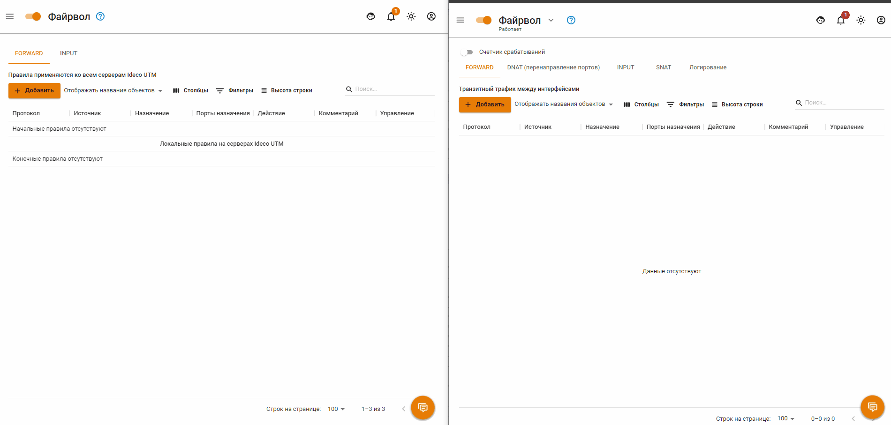

# Политики и объекты

Объекты и правила, созданные в этом разделе влияют на все подключенные сервера UTM одновременно.

## Файрвол

Добавляются только правила Forward.

Правила, созданные в ЦК и UTM, можно условно разделить на 3 приоритета - высокий, средний и низкий: 
* Правила с **высоким** и **низким** приоритетом создаются только в ЦК и видны в интерфейсе ЦК и UTM. 
* Правила **среднего** приоритета создаются только в UTM и не видны в интерфейсе ЦК.

Высокий или низкий приоритет указывается при создании правила. Для этого нажмите **Добавить** и выберите вид правила:
* **Начальное** - высокий приоритет. Отображается в таблице **Протокол**.
* **Конечное** - низкий приоритет. Отображается в таблице **Локальные правила на серверах Ideco UTM**.

Визуально, разделение правил выглядит следующим образом:
 * В ЦК:
  

 * В UTM:
  

Также управление правилами возможно только внутри приоритета. Например: правило из таблицы **Протокол** в таблицу **Локальные правила на серверах Ideco UTM** перенести нельзя.

Ниже пример добавления правил через ЦК. Слева интерфейс подключенного UTM, справа интерфейс ЦК:

## Объекты

Объекты, созданные в ЦК, переносятся в подключенные UTM. Администратор UTM может использовать эти объекты для создания правил.

При удалении объекта из ЦК, объект удаляется и из UTM. Если в UTM было создано правило с удаленным объектом, то это правило будет отмечено иконкой .


Принцип создания и удаления объектов в ЦК соответствуют принципам UTM. Подробное описание в статье [Объекты](../../access-rules/aliases.md).
