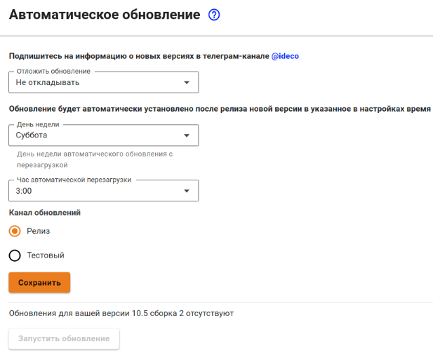


Название службы раздела **Автоматическое обновление сервера**: `ideco-sysupdate-backend`. \
Список служб для других разделов доступен по [ссылке](terminal.md).



Обновление сервера возможно исключительно по сети. Обновиться с помощью установочного диска или флешки невозможно.

Отключить автоматическое обновление Ideco UTM нельзя.


## Автоматическое обновление

* Поле **Отложить обновления** - время, на которое будет отложено обновление (максимальный срок 6 месяцев с даты релиза последней версии, до которой доступно обновление);
* Поле **День недели** - день недели запуска автоматического обновления;
* Поле **Час автоматической перезагрузки** - позволяет выбрать час запуска автоматического обновления;
* Поле **Канал обновлений** - выберите **Релиз** или **Тестовый**. Канал **Релиз** позволяет обновляться на стабильно работающие версии. Канал **Тестовый** позволяет быстрее обновляться как на релизные версии, так и на последние бета-версии продукта во время коротких периодов бета-тестирования новых мажорных версий. По умолчанию выбран пункт **Релиз**;
* Кнопка **Запустить обновление** - запускает механизм принудительного обновления. Если кнопка неактивна, обновления отсутствуют.

Обновить серверы Ideco UTM, подключенные к центральной консоли, можно через Ideco Center. Для этого нужно перейти в интерфейс UTM одним из способов, указанных в разделе [Центральная консоль](central-console/README.md). 


Кнопка принудительного обновления активна, когда обновление уже скачано, и только применяет его, инициировать скачивание нельзя. 

После принудительного обновления потребуется полная перезагрузка сервера. 


После проведения процедуры обновления новая версия будет отображаться в верхнем левом углу локальной консоли и веб-интерфейса администратора.

## Процесс выхода релизов в каналы обновлений

**Teстовый** канал обновлений позволяет быстрее обновляться до новых версий (релизных или бета-версий во время их активного тестирования). После выхода бета-версии UTM в **Teстовый** канал ожидается обратная связь от пользователей по использованию новой версии продукта. Обратная связь позволяет выявить недочеты и уязвимости в продукте. После их исправления происходит выкладка в канал **Релиз**.


Если в версии UTM, вышедшей в канал **Релиз**, в ходе использования выявляются недочеты, то они исправляются ближайшими обновлениями версии. Обновление в канале **Релиз** появляется постепенно.


## Особенности обновления UTM

Обновление будет автоматически установлено в указанное в настройках время после релиза новой версии.

Автоматическое обновление сервера можно отложить максимум на 6 месяцев. Этот период будет отсчитываться от **даты релиза** последнего доступного обновления и корректироваться в соответствии с указанным для обновления днем недели. 

Даты релизов можно посмотреть на [сайте](https://ideco.ru/changelog) или в документации в разделе [Changelog](/changelog/ideco-utm/README.md).

Номер мажорной версии UTM - часть номера до точки (например, 14.x), номер минорной версии - часть после точки (например, x.7).

Автоматическое обновление Ideco UTM на следующую мажорную версию возможно только после обновления до последней выпущенной в релиз минорной версии. Например, UTM 14.2 можно обновить до версии 14.10, а затем - до версии 15.7. 


Если обновление было отложено на 6 месяцев, но за это время вышел новый минорный релиз, дата обновления сдвигается. 6 месяцев теперь отсчитываются с даты выхода последнего доступного минорного релиза.

Если сервер обновляется на последний минор и с момента релиза следующей мажорной версии прошло больше 6 месяцев, отложить обновление будет невозможно. UTM начнет обновляться сразу (с учетом указанного дня недели и времени).

