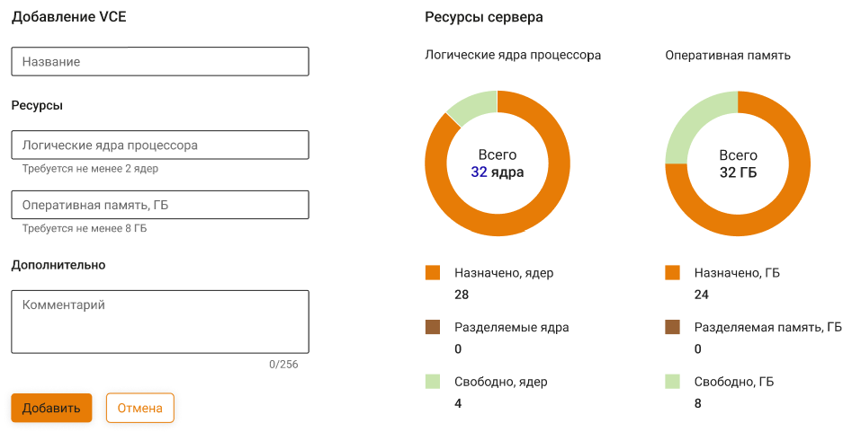

# VCE

VCE - это функция Ideco NGFW, которая позволяет создавать виртуальные серверы на одном корневом NGFW. Это дает возможность разбить одну локальную сеть на несколько независимых подсетей, индивидуально создавать для каждой из этих сетей политики безопасности и объекты, а также разграничивать доступ и независимо управлять VCE. При этом нет необходимости устанавливать и настраивать для этого отдельные физические серверы. 

Функциональность созданных внутри NGFW виртуальных VCE-серверов почти не отличается от функциональности NGFW. 

**Возможности VCE:**

* [x] Создание виртуальных серверов Ideco NGFW и настройка независимых сетевых интерфейсов. 
* [x] Независимая настройка политик безопасности и прав доступа различным виртуальным NGFW. 
* [x] Запуск и остановка виртуальных серверов с одного корневого NGFW.

В интерфейсе виртуального сервера недоступно создание кластера и VCE, а также изменение статуса **Разрешить интернет всем**.

## Создание виртуального сервера

Чтобы создать виртуальный сервер в рамках VCE, перейдите в раздел **Управление сервером -> VCE** и выполните действия:

1\. Нажмите кнопку **Добавить**.

2\. Введите название сервера.

3\. Из раскрывающегося списка выберите сетевые карты, которые хотите передать виртуальному серверу. Для создания VCE нужна минимум одна сетевая карта, их максимальное количество не ограничено:



Переданная VCE сетевая карта будет недоступна для использования корневым NGFW, пока VCE включен.

Если VCE выключен, переданные ему сетевые карты становятся вновь доступны корневому NGFW, их можно использовать для создания нового виртуального сервера. При этом VCE, которому они принадлежали ранее, станет недоступен после включения. 



Не присваивайте VCE сетевые карты, которые используются корневым NGFW. В противном случае доступ к веб-интерфейсу NGFW будет потерян.


4\. Нажмите **Сохранить**.\
Виртуальный сервер появится в таблице:



Чтобы отредактировать VCE, нажмите на  напротив его названия. При редактировании можно менять название виртуального сервера и доступные ему сетевые карты. Редактирование доступно в том числе для работающего VCE.

## Переход в веб-интерфейс виртуального сервера

После создания VCE для всех сетевых карт, которые при старте виртуального сервера были к нему подключены, создается настройка локальных сетевых интерфейсов с получением IP-адреса по DHCP. Подключиться к веб-интерфейсу VCE можно будет по любому из этих адресов. Чтобы это сделать, выполните действия:

1\. Перейдите в **Управление сервером -> Терминал** и введите команду:

```
machinectl list
```
Из ответа терминала скопируйте название нужного вам VCE:


2\. Перейдите в командную оболочку VCE, введите команду:

```
machinectl shell vce-7da8bf98-886f-4347-9799-9921b559f76d
```
* vce-7da8bf98-886f-4347-9799-9921b559f76d - название VCE, скопированное в пункте 1.

3\. Введите команду `ip a` и из ответа терминала скопируйте один из IP-адресов, соответствующих локальным интерфейсам VCE, например, `Leth1`:


4\. Введите этот IP-адрес в адресную строку браузера, дополнительно указав порт 8443.\
**Пример:** `192.168.0.96:8443`

5\. Введите в форме авторизации установленные по умолчанию логин и пароль:
* Логин - `administrator`
* Пароль - `servicemode1`


Изменить логин и пароль администратора VCE можно в веб-интерфесе виртуального сервера в разделе **Управление сервером -> Администраторы**.


Удалить VCE можно, нажав на :


