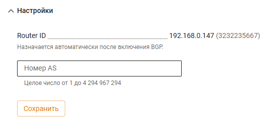
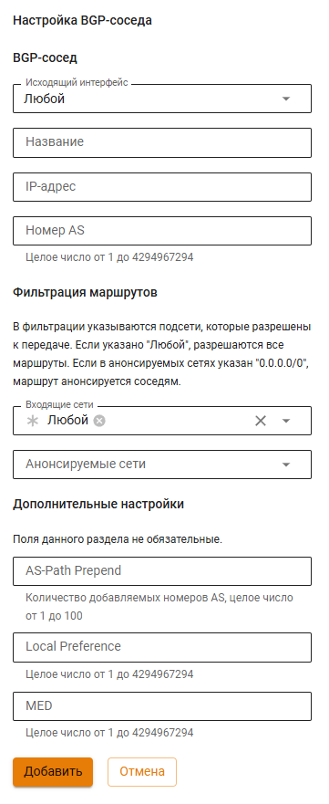
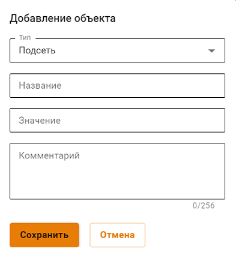

# BGP

В Ideco UTM 12 реализована поддержка BGP (Border Gateway Protocol) — это основной протокол динамической маршрутизации, который используется в Интернете.

## Настройка своей автономной системы

1\. Введите номер вашей автономной системы в строку **Номер AS** и нажмите **Сохранить**:

2.Переведите переключатель раздела **BGP** в положение **включен**;

3\. Ideco UTM заполнит поле **Router ID** автоматически, если переключатель раздела BGP в положении включен.

## Настройка BGP соседей

1\. Для добавления BGP соседа нажмите **Добавить** в правом верхнем углу;

2\. Заполните следующие поля:

* **Название** - любое значение;
* **IP-адрес** - IP-адрес BGP соседа;
* **Номер AS** - номер AS BGP соседа;
* **Входящие сети** - выберите сеть, информацию от которых хотите получать. По умолчанию установлен объект _Любой_;
* **Анонсируемые сети** - выберите сеть, информацию о которой хотите отправлять;
* **AS-Path Prepend** - чем больше значение, тем менее приоритетным становится канал;
* **Local Preference** - определяет приоритет пути для выхода трафика. Чем больше значение, тем менее приоритетным становится канал;
* **MED** - определяет приоритет пути для входа трафика. Чем меньше значение, тем приоритетнее путь.

Если нужного объекта для фильтрации нет, то создать его можно нажав на поле **Входящие сети** или **Анонсируемые сети** и выбрать **Создать новый объект**:

* **Название** - любое значение;
* **Значение** - значение подсети в формате: _подсеть/маска подсети_, например _192.168.100.0/24_.

