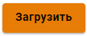

# Сертификаты

В этом разделе отображаются SSL сертификаты/цепочки сертификатов, список которых формируется следующими модулями: модуль обратного проксирования, VPN-серверы IKEv2 и SSTP, веб-интерфейс, веб-авторизация, почта и т.д.

### Действующие сертификаты

В таблице _Действующие сертификаты_ отображаются автоматически сгенерированные, а также загруженные цепочки сертификатов, используемые модулями Ideco UTM.


Если в таблице _Действующие сертификаты_ одна и та же цепочка сертификатов указана в нескольких строках, то данная цепочка используется несколькими модулями.


### Загруженные сертификаты

В таблице _Загруженные сертификаты_ отображаются все загруженные цепочки сертификатов, а также корневой сертификат Ideco UTM. Подробнее в [Загрузка своего SSL-сертификата на сервер](upload-ssl-certificate-to-server.md)


Для просмотра основной информации о сертификате (серийный номер, срок действия и.т.д.), нажмите кнопку  (2) (2) (2) (2) (2) (2) (4) (4) (4) (4) (1).png>).

Для загрузки корневого сертификата на сервер, нажмите кнопку .

Для загрузки цепочки сертификатов с приватным ключом на сервер, используйте кнопку .


## Как происходит выпуск сертификата?

1. Создается локальная цепочка сертификатов, подписанная корневым (самоподписанным) сертификатом;
2. Параллельно с созданием локальной цепочки сертификатов, отправляется запрос на выпуск цепочки в Let’s Encrypt;
3. При успешном выпуске цепочки сертификатов Let’s Encrypt, он заменит собой локальную цепочку;
4. Если выпуск цепочки сертификатов Let’s Encrypt завершился неудачей, то будет использоваться локальная цепочка сертификатов.

### Как происходит перевыпуск сертификата?

При перевыпуске не корневой цепочки сертификатов, UTM попробует актуализировать цепочку следующим образом:

* Проверяет загруженные сертификаты. Если сертификат найден, то заменит предыдущую цепочку на найденную загруженную;
* Если загруженных сертификатов нет, то Ideco UTM обратится к Let’s Encrypt для выпуска новой цепочки сертификатов;
* Если цепочка от Let’s Encrypt получена, то она отобразится в таблице;
* Если получить цепочку сертификатов от Let’s Encrypt не удалось, то создается локальная цепочка сертификатов, подписанная корневым сертификатом.

При перевыпуске корневого сертификата, UTM заменит предыдущий сертификат на автоматически сгенерированный корневой сертификат.

## Особенности


Если вы хотите повторить попытку получения сертификата Let’s Encrypt, вместо самоподписанного, то нужно нажать на кнопку **Перевыпустить** в столбце **Управление**.

При замене/перевыпуске цепочки корневого сертификата, [IPsec-соединения](../ipsec/branch-office-and-main-office.md) **Главный офис <–> Филиал** перестанут работать и их необходимо будет пересоздать.

Если вы хотите заменить автоматически выпущенную цепочку сертификатов на свою, то при загрузке собственной цепочки сертификатов, **CN(Общее имя)** последнего сертификата в цепочке должно соответствовать домену для которого сертификат загружается.

Сертификат Let’s Encrypt **выпускается на 3 месяца** и будет **автоматически перевыпущен** по окончании срока действия.

Из этого раздела можно скачать корневой (самоподписанный) сертификат, нажав на соответствующую ссылку.



Для загрузки SSL-сертификата на сервер смотрите статью [Загрузка своего SSL-сертификата на сервер](upload-ssl-certificate-to-server.md).

