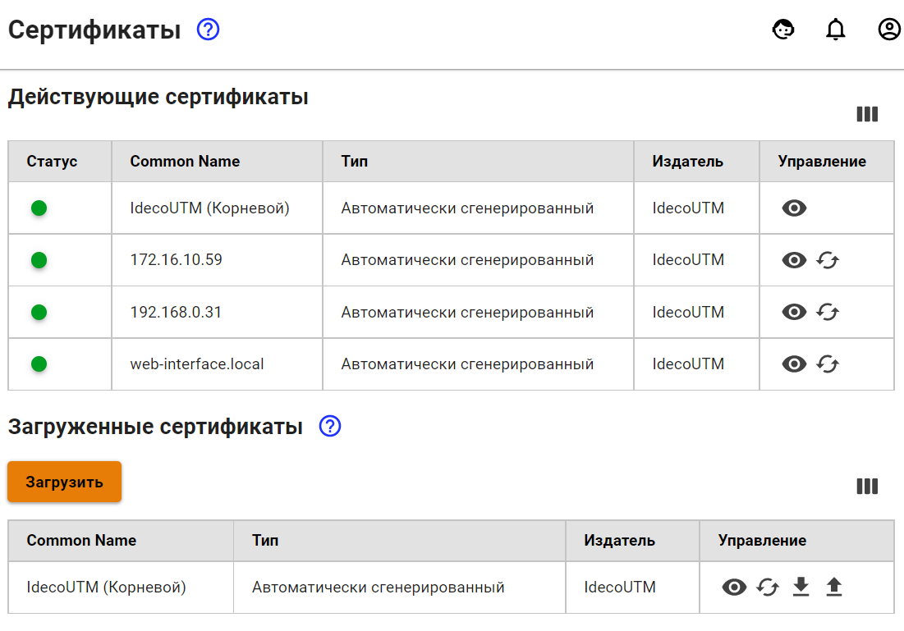

# Сертификаты

В этом разделе отображаются SSL сертификаты, список которых формируется следующими модулями: модуль обратного проксирования, VPN-серверы IKEv2 и SSTP, веб-интерфейс, веб-авторизация, почта и т.д.

## Элементы управления

| Элемент | Название | Описание |
| :---: | :--- | :--- |
|    | Добавить | Загрузка своих сертификатов на сервер |
|   | Просмотреть | Просмотр основной информации о сертификате: серийный номер, «действителен с», «действителен до» и.т.д. |
|   | Скачать | Скачивание сертификата |
|   | Перевыпустить | Перевыпуск сертификата |
|   | Удалить | Удаление загруженной вручную цепочки сертификатов |

## Как происходит выпуск сертификата?

1. Если вручную загружена цепочка сертификатов для некоторого домена, то используется финальный сертификат из неё. Иначе, сертификат выпускается автоматически.
2. Создается локальный сертификат, подписанный корневым \(самоподписанным\) сертификатом.
3. Параллельно с созданием локального сертификата, отправляется запрос на выпуск сертификата Let’s Encrypt.
4. При успешном выпуске сертификата Let’s Encrypt он заменит собой локальный сертификат.
5. Если выпуск сертификата Let’s Encrypt завершился неудачей, то будет использоваться локальный сертификат.

## Особенности


Если вы хотите повторить попытку получения сертификата Let’s Encrypt, вместо самоподписанного, то нужно нажать на кнопку **Перевыпустить** в столбце **Управление**.

Если вы хотите заменить автоматически выпущенный сертификат на свой, то при загрузке собственной цепочки сертификатов, **CN\(Общее имя\)** крайнего сертификата должно соответствовать домену для которго сертификат загружается. 

Сертификат Let’s Encrypt **выпускается на 3 месяца** и будет **автоматически перевыпущен** по окончании срока действия. 

Из этого раздела можно скачать корневой \(самоподписанный\) сертификат, нажав на соответствующую ссылку. 



Для загрузки SSL-сертификата на сервер смотрите статью  [Загрузка своего SSL-сертификата на сервер](upload-ssl-certificate-to-server.md).


