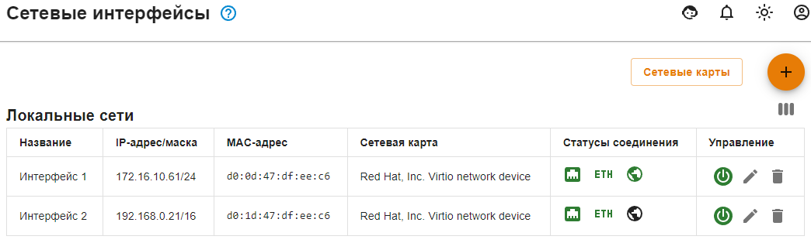
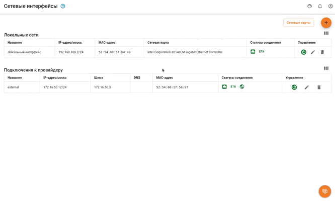
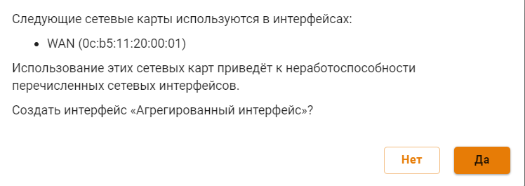
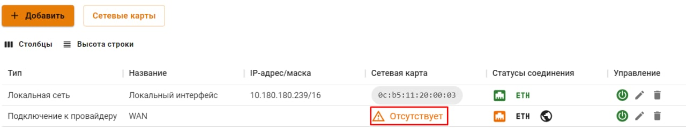

# Сетевые интерфейсы

Все созданные интерфейсы представлены в виде таблицы:

В режиме редактирования появляется возможность смены названия, сетевой карты (по кнопке ) и настроек конфигурации (вручную или автоматически): 

Если сетевая карта уже используется каким-либо интерфейсом, то UTM выведет окно с ошибкой **Комбинации сетевой карты/vlan тега должны быть уникальны**:


При миграции UTM с одной физической машины на другую (перенос диска или восстановление резервной копии на новом оборудовании), будут восстановлены настройки всех сетевых интерфейсов, указанные до миграции. Для удаления ненужных интерфейсов воспользуйтесь кнопкой .

**Например:** исходная версия UTM 11.Х -> провели миграцию UTM на новое оборудование -> настроили новое оборудование -> провели обновление -> в разделе Сетевые интерфейсы будут отображаться старые (до миграции) и новые (после миграции и настройки) сетевые интерфейсы.


# Агрегированные интерфейсы


Агрегированные интерфейсы реализованы по стандарту LACP (IEEE **802.3ad**). 

Используется **active** режим - постоянная рассылка LACP пакетов. 

Проверка соседства осуществляется в режиме **slow** - раз в 30 секунд. 

Количество сетевых карт, объединяемых в агрегированный интерфейс, не ограничено.


Для объединения нескольких сетевых интерфейсов в один агрегированный, перейдите в раздел **Сервисы -> Сетевые интерфейсы** и в таблице **Агрегированные интерфейсы (LACP)** нажмите **Добавить**. Укажите название, выберите сетевые карты и нажмите **Сохранить**.

При выборе сетевой карты обращайте внимание на пиктограммы:
*  - сетевая карта уже используется другим интерфейсом;
*  - сетевая карта не используется.

Если были выбраны уже использующиеся сетевые интерфейсы, то при нажатии на кнопку **Сохранить** появится сообщение:

При нажатии на **Да** сетевая карта будет использоваться агрегированным интерфейсом и будет недоступна для ранее созданного сетевого интерфейса:

На основе созданного агрегированного интерфейса, можно создавать любой логический интерфейс, в том числе с указанием VLAN.
