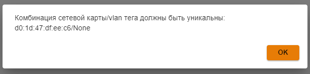

# Сетевые интерфейсы

Подробное описание создания и настройки каждого типа сетевого интерфейса, описаны в следующих инструкциях:

* [Локальный Ethernet](local-ethernet.md)
* [Внешний Ethernet](ethernet-connection.md)
* [Ethernet + PPTP](pptp-connection.md)
* [Ethernet + L2TP](l2tp-connection.md)
* [Ethernet + PPPoE](pppoe-connection.md)

Все созданные интерфейсы представлены в виде таблицы:

В режиме редактирования появляется возможность смены названия, сетевой карты (по кнопке ) и настроек конфигурации (вручную или автоматически): 

Если сетевая карта уже используется каким-либо интерфейсом, то UTM выведет окно с ошибкой **Комбинации сетевой карты/vlan тега должны быть уникальны**:

