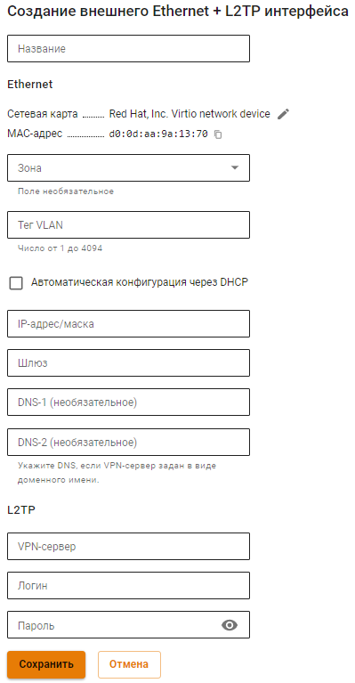

# Настройка подключения по L2TP

Для настройки такого подключения в веб-интерфейсе необходимо выполнить следующие действия:

1\. Перейдите в меню **Сервисы -> Сетевые интерфейсы**.

2\. Нажмите **Добавить** в левом верхнем углу окна и выберите пункт **Ethernet + L2TP**

3\. Выберите сетевую карту.

4\. Заполните поля, указанные в таблице ниже:

* **Название** - Имя для идентификации интерфейса. Максимальное количество символов - 42;
* **Сетевая карта** - Сетевой адаптер, который будет использоваться для подключения к интернет-провайдеру;
* **Зона** - Выберите объект типа **Зона** в состав которой будет входить создаваемый сетевой интерфейс. Максимальное количество сетевых интерфейсов в зоне - 64;
* **Тег VLAN** - VLAN ID, в котором будет присутствовать NGFW. Такой сетевой интерфейс считается VLAN-интерфейсом. Заполняется только в том случае если сетевая карта уже используется. Стандарт VLAN 802.3ad;
* **Автоматическая конфигурация через DHCP** - Используйте, если ваш интернет-провайдер поддерживает автоматическую настройку Ethernet-интерфейса с помощью протокола DHCP;
* **IP-адрес/маска** - Назначьте на интерфейс несколько IP-адресов. Должен быть указан хотя бы один IP-адрес;
* **Шлюз** - IP-адрес шлюза;
* **DNS** - Доступно два поля для указания DNS сервера (необязательно);
* **VPN-сервер** - IP-адрес или доменное имя L2TP-сервера;
* **Логин** - Имя пользователя для подключения по L2TP;
* **Пароль** - Пароль для подключения по L2TP.

5\. Убедитесь в корректности введённых значений и нажмите на кнопку **Сохранить**.

**Пример настройки:**


Для проверки скорости ранее настроенного интерфейса перейдите в раздел **Управление сервером -> Терминал** и введите `speedtest-cli`. 

Пример вывода команды:

